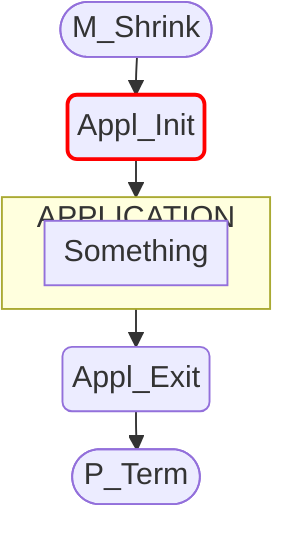
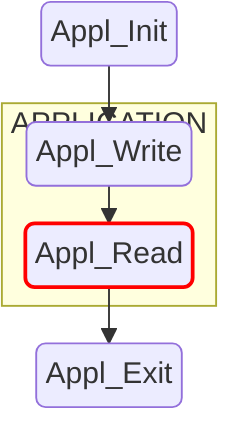
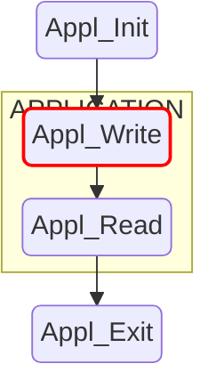
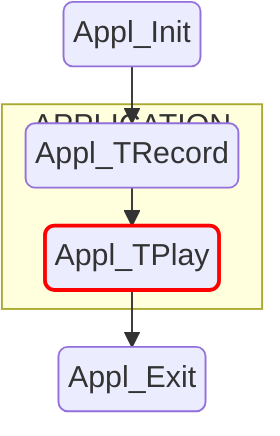
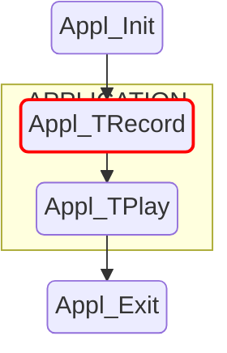
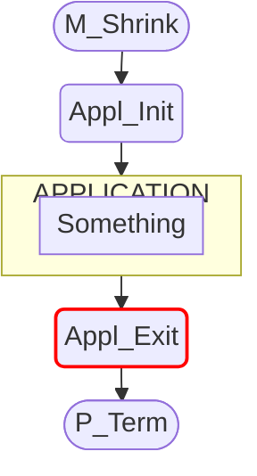

# AES (Application Services Library)

The **AES** is responsible for handling the graphic interface (menu, messaging services) and windowing system (object rendering and manipulation).

It also deals with graphical applications' lifecycle.

## Function list

Functions below are sorted by name.

| Name								| Number		| Fingerprint	| Function											|
| :---								| :---			| :---			| :---												|
| [Appl_Exit](#appl_exit)			| 19 (0x13)		| $13000100		| Deregister the application with the AES			|
| [Appl_Find](#appl_find)			| 13 (0x0D)		| $0D000101		| Find application `ap_id` from its filename		|
| [Appl_GetInfo](#appl_getinfo)		| 130 (0x82)	| $82010500		| Doing this.					|
| [Appl_Init](#appl_init)			| 10 (0x0A)		| $0A000100		| Register the application with the AES				|
| [Appl_Read](#appl_read)			| 11 (0x0B)		| $0B020101		| Read a message from event buffer					|
| [Appl_Search](#appl_search)		| 18 (0x12)		| $12010301		| Find application `ap_id` from its filename 		|
| [Appl_TPlay](#appl_tplay)			| 14 (0x0E)		| $0E020101		| Playback users mouse and keyboard input			|
| [Appl_TRecord](#appl_trecord)		| 15 (0x0F)		| $0F010101		| Record users mouse and keyboard input				|
| [Appl_Write](#appl_write)			| 12 (0x0C)		| $0C020101		| Write a message to an application					|
| [Evnt_Button](#evnt_button)		| 21 (0x15)		| $15030500		| Wait for mouse button event						|
| [Evnt_DClick](#evnt_dclick)		| 26 (0x1A)		| $1A020100		| Set or read speed of mouse button double-click	|
| [Evnt_KeyBd](#evnt_keybd)			| 20 (0x14)		| $14000100		| Wait for a keyboard event							|
| [Evnt_Mesag](#evnt_mesag)			| 23 (0x17)		| $17000101		| Wait for message event							|
| [Evnt_Mouse](#evnt_mouse)			| 22 (0x16)		| $16050500		| Wait for mouse pointer to enter/leave a rectangle	|
| [Evnt_Multi](#evnt_multi)			| 25 (0x19)		| $19100701		| Wait for multiple events							|
| [Evnt_Timer](#evnt_timer)			| 24 (0x18)		| $18020100		| Wait for a specified amount of time to pass		|
| [Form_Alert](#form_alert)			| 52 (0x34)		| $34010101		| Doing this.			|
| [Form_Button](#form_button)		| 56 (0x38)		| $38020201		| Doing this.			|
| [Form_Center](#form_center)		| 54 (0x36)		| $36000501		| Doing this.			|
| [Form_Dial](#form_dial)			| 51 (0x33)		| $33090100		| Doing this.			|
| [Form_Do](#form_do)				| 50 (0x32)		| $32010101		| Doing this.			|
| [Form_Error](#form_error)			| 53 (0x35)		| $35010100		| Doing this.			|
| [Form_KeyBd](#form_keybd)			| 55 (0x37)		| $37030301		| Doing this.			|
| [FSel_ExInput](#fsel_exinput)		| 91 (0x5B)		| $5B000203		| Doing this.			|
| [FSel_Input](#fsel_input)			| 90 (0x5A)		| $5A000202		| Doing this.			|
| [Graf_DragBox](#graf_dragbox)		| 71 (0x47)		| $47080300		| Doing this.			|
| [Graf_GrowBox](#graf_growbox)		| 73 (0x49)		| $49080100		| Doing this.			|
| [Graf_Handle](#graf_handle)		| 77 (0x4D)		| $4D000500		| Doing this.			|
| [Graf_MkState](#graf_mkstate)		| 79 (0x4F)		| $4F000500		| Doing this.			|
| [Graf_Mouse](#graf_mouse)			| 78 (0x4E)		| $4E010101		| Doing this.			|
| [Graf_MoveBox](#graf_movebox)		| 72 (0x48)		| $48060100		| Doing this.			|
| [Graf_RubberBox](#graf_rubberbox)	| 70 (0x46)		| $46040300		| Doing this.			|
| [Graf_ShrinkBox](#graf_shrinkbox)	| 74 (0x4A)		| $4A080100		| Doing this.			|
| [Graf_SlideBox](#graf_slidebox)	| 76 (0x4C)		| $4C030101		| Doing this.			|
| [Graf_WatchBox](#graf_watchbox)	| 75 (0x4B)		| $4B040101		| Doing this.			|
| [Menu_Attach](#menu_attach)		| 37 (0x25)		| $25020102		| Doing this.			|
| [Menu_Bar](#menu_bar)				| 30 (0x1E)		| $1E010101		| Show or hide menu bar								|
| [Menu_ICheck](#menu_icheck)		| 31 (0x1F)		| $1F020101		| Doing this.			|
| [Menu_IEnable](#menu_ienable)		| 32 (0x20)		| $20020101		| Doing this.			|
| [Menu_IStart](#menu_istart)		| 38 (0x26)		| $26030101		| Doing this.			|
| [Menu_PopUp](#menu_popup)			| 36 (0x24)		| $24020102		| Doing this.			|
| [Menu_Register](#menu_register)	| 35 (0x23)		| $23010101		| Doing this.			|
| [Menu_Setting](#menu_setting)		| 39 (0x27)		| $27010101		| Doing this.			|
| [Menu_Text](#menu_text)			| 34 (0x22)		| $22010102		| Doing this.			|
| [Menu_TNormal](#menu_tnormal)		| 33 (0x21)		| $21020101		| Doing this.			|
| [Objc_Add](#objc_add)				| 40 (0x28)		| $28020101		| Doing this.			|
| [Objc_Change](#objc_change)		| 47 (0x2F)		| $2F080201		| Doing this.			|
| [Objc_Delete](#objc_delete)		| 41 (0x29)		| $29010101		| Doing this.			|
| [Objc_Draw](#objc_draw)			| 42 (0x2A)		| $2A060101		| Doing this.			|
| [Objc_Edit](#objc_edit)			| 46 (0x2E)		| $2E040201		| Doing this.			|
| [Objc_Find](#objc_find)			| 43 (0x2B)		| $2B040101		| Doing this.			|
| [Objc_OffSet](#objc_offset)		| 44 (0x2C)		| $2C010301		| Doing this.			|
| [Objc_Order](#objc_order)			| 45 (0x2D)		| $2D020101		| Doing this.			|
| [Objc_SysVar](#objc_sysvar)		| 48 (0x30)		| $30040300		| Doing this.			|
| [Rsrc_Free](#rsrc_free)			| 111 (0x6F)	| $6F000100		| Doing this.			|
| [Rsrc_GAddr](#rsrc_gaddr)			| 112 (0x70)	| $70020100		| Doing this.			|
| [Rsrc_Load](#rsrc_load)			| 110 (0x6E)	| $6E000101		| Doing this.			|
| [Rsrc_ObFix](#rsrc_obfix)			| 114 (0x72)	| $72010101		| Doing this.			|
| [Rsrc_RcFix](#rsrc_rcfix)			| 115 (0x73)	| $73000101		| Doing this.			|
| [Rsrc_SAddr](#rsrc_saddr)			| 113 (0x71)	| $71020101		| Doing this.			|
| [Scrp_Read](#scrp_read)			| 80 (0x50)		| $50000101		| Doing this.			|
| [Scrp_Write](#scrp_write)			| 81 (0x51)		| $51000101		| Doing this.			|
| [Shel_Envrn](#shel_envrn)			| 125 (0x7D)	| $7D000103		| Doing this.			|
| [Shel_Find](#shel_find)			| 124 (0x7C)	| $7C000101		| Doing this.			|
| [Shel_Get](#shel_get)				| 122 (0x7A)	| $7A010101		| Doing this.			|
| [Shel_Put](#shel_put)				| 123 (0x7B)	| $7B010101		| Doing this.			|
| [Shel_Read](#shel_read)			| 120 (0x78)	| $78000102		| Doing this.			|
| [Shel_Write](#shel_write)			| 121 (0x79)	| $79030102		| Doing this.			|
| [Wind_Calc](#wind_calc)			| 108 (0x6C)	| $6C060500		| Doing this.			|
| [Wind_Close](#wind_close)			| 102 (0x66)	| $66010100		| Doing this.			|
| [Wind_Create](#wind_create)		| 100 (0x64)	| $64050100		| Doing this.			|
| [Wind_Delete](#wind_delete)		| 103 (0x67)	| $67010100		| Doing this.			|
| [Wind_Find](#wind_find)			| 106 (0x6A)	| $6A020100		| Doing this.			|
| [Wind_Get](#wind_get)				| 104 (0x68)	| $68020500		| Doing this.			|
| [Wind_New](#wind_new)				| 109 (0x6D)	| $6D000000		| Doing this.			|
| [Wind_Open](#wind_open)			| 101 (0x65)	| $65050100		| Doing this.			|
| [Wind_Set](#wind_set)				| 105 (0x69)	| $69060100		| Doing this.			|
| [Wind_UpDate](#wind_update)		| 107 (0x6B)	| $6B010100		| Doing this.			|

---

<div align="right"><a href=#function-list>Function list</a> :top:</div>

Each **AES** function is described with the following format:

#### Function name

* function number (function number in `0x` **Intel** hexadecimal)
* function "fingerprint" (in `$` **Motorola** hexadecimal)
* first appeared in **TOS** x.xx or **AES** x.xx

Explanation of the function.

| Name		| Cell			| Meaning			|
| :---		| :---			| :---				|
| Input		| `Control[0]`	| 0: value			|
| Call		| 				| 					|
| Result	| `Int_Out[0]`	| 0+: return value	|

To call an **AES** function in `m68k` assembly:

```m68k
			; filling the input arrays

			move.w	#200,D0			; AES (200)
			move.l	#AES_Params,D1
			TRAP	#2				; *** AES/VDI ***

			; reading the output arrays (if needed)
```

Unlike `BDOS` functions, there is no need to restore the stack pointer as everything happens in the arrays.

To call an **AES** function in `C`:

```c
	// filling the input arrays

	aes(AES_Params);	// Inlined assembly to call the TRAP

	// reading the output arrays (if needed)
```

> [!IMPORTANT]
> Performing the `TRAP #2` from `C` is quite dependent of the compiler used.

---

<div align="right"><a href=#function-list>Function list</a> :top:</div>

The **AES** uses another set of function parameter arrays than the [VDI]:

[VDI]: VDI.md

| Name			| [Size]	| Usage														|
| :---			| :---		| :---														|
| `AES_Handle`	| WORD		| Application's **AES** ID once initialized					|
| `Control`		| WORD x 5	| Function code and number of input/output parameters		|
| `Global`		| WORD x 14	| **AES** informational outputs (depend on the function)	|
| `Int_In`		| WORD x 16	| Input parameters											|
| `Int_Out`		| WORD x 7	| Output results											|
| `Addr_In`		| LONG x 3	| Input pointers											|
| `Addr_Out`	| LONG x 1	| Output pointers											|
| `AES_Params`	| LONG x 6	| Pointers to the **AES** arrays (`Control` to `Addr_Out`)	|

[Size]: https://github.com/Kochise/atari-tos#programming

The number of cells for each array is the minimum required, usually enough to cover all **AES** functions.

The **AES** arrays can be continuous into memory or not. The `AES_Params` list will point to the first cell of each array anyway.

In case of the application is multithreaded and may call several **AES** functions in parallel, it is possible to have multiple copies of the **AES** arrays with their own `AES_Params` list.

<details>
<summary>Declaration in m68k assembly (click to expand)</summary>

```m68k
			SECTION	BSS

AES_Handle	ds.w	1

Control		ds.w	5
Global		ds.w	14
Int_In		ds.w	16
Int_Out		ds.w	7
Addr_In		ds.l	3
Addr_Out	ds.l	1

			SECTION	DATA

AES_Params	dc.l	#Control, #Global, #Int_In, #Int_Out, #Addr_In, #Addr_Out
```

</details>

<details>
<summary>Declaration in C (click to expand)</summary>

```c
short AES_Handle;

short Control[5]	= { 0, };
short Global[14]	= { 0, };
short Int_In[16]	= { 0, };
short Int_Out[7]	= { 0, };
int Addr_In[3]		= { 0, };
int Addr_Out[1]		= { 0, };

void* AES_Params[6]	= { Control, Global, Int_In, Int_Out, Addr_In, Addr_Out };
```

</details>

Every **AES** function *needs* to have the `Control` cells filled in accurately **before** being called:

* `Control[0]`: **AES** function number
* `Control[1]`: number of input parameters in `Int_In`
* `Control[2]`: expected number of output in `Int_Out`
* `Control[3]`: number of input parameters in `Addr_In`
* `Control[4]`: expected number of output in `Addr_Out`

Filling in the `Control[1-4]` cells might be counter intuitive and counter productive since the **AES** functions should know what they request as input and produce as output.

Let's say it is a "security" measure to avoid buffer overflow since the **AES** isn't "variadic" (aka "varargs" or "va_list") capable, the coder provides the usable size of each array.

Before every **AES** function call.

However each function's number of parameters doesn't change much, hence a "fingerprint" is provided to alleviate this issue.

The function "fingerprint" is a 32 bits value whose individual bytes are used to fill the `Control[0-3]` cells with commonly used values, `Control[4]` being set to 0 most of the time anyway.

---

<div align="right"><a href=#function-list>Function list</a> :top:</div>

Functions below are sorted by number.

### APPL (Application Services Library)

#### Appl_Init

* 10 (0x0A)
* $0A000100
* **TOS** 1.00

Register the application with the AES.

Should be one of the first call after GEMDOS initialization.



> [!NOTE]
> You may have to "sanitize" `Global` before calling the function to ensure the output is modified accordingly.

| Name		| Cell				| Meaning																|
| :---		| :---				| :---																	|
| Input		| `Control[0]`		| 10: function number													|
| 			| `Control[1]`		| 0: `Int_In`															|
| 			| `Control[2]`		| 1: `Int_Out`															|
| 			| `Control[3]`		| 0: `Addr_In`															|
| 			| `Control[4]`		| 0: `Addr_Out`															|
| Call		| 					| 																		|
| Result	| `Int_Out[0]`		| 0+: `ap_id` of the application<br>-1: error							|
| 			| `Global[0]`		| **AESversion**<br>0: **AES** not available (ie. during boot)<br>BCD: **AES** version ($0340 = 3.40)	|
| 			| `Global[1]`		| **AESnumapps**<br>1+: number of concurrent application possible<br>-1: Multitasking **AES** (when `Global[0]` != 0)	|
| 			| `Global[2]`		| **AESapid**<br>`ap_id` (same as `Int_Out[0]`)							|
| 			| 					| 																		|
| 			| `Global[3-4]`		| **AESappglobal**: user available										|
| 			| `Global[5-6]`		| **AESrscfile**: pointer to root of resource tree<br>(see [Rsrc_Load](#rsrc_load))	|
| 			| `Global[7-8]`		| pointer to resource buffer<br>(see [Rsrc_Load](#rsrc_load))			|
| 			| `Global[9]`		| size of loaded resource (64k max)<br>(see [Rsrc_Load](#rsrc_load))	|
| 			| `Global[10]`		| number of planes of the **VDI** workstation opened by the **AES**		|
| 			| `Global[11-12]`	| reserved																|
| 			| `Global[13]`		| **AESmaxchar**: maximum character used for [vst_height](#vst_height) (**AES** 4.0+)	|
| 			| `Global[14]`		| **AESminchar**: minimum character used for [vst_height](#vst_height) (**AES** 4.0+)	|

<details>
<summary>Use in C (click to expand)</summary>

```c
short Appl_Init(void)
{
	// Initialization using the "fingerprint"
	short Control[] = { 10, 0, 1, 0, 0 };

	// Or...
	Control[0]	= 10;	// Appl_Init
	Control[1]	= 0;	// Int_In
	Control[2]	= 1;	// Int_Out
	Control[3]	= 0;	// Addr_In
	Control[4]	= 0;	// Addr_Out

	// Clear some variable that may be used to check if an AES is loaded
	Global[0]	= 0;	// AES version number
	Global[2]	= -1;	// AES application ID
	Int_Out[0]	= -1;	// AES application ID

	aes(AES_Params);	// Inlined assembly to call the TRAP

	return Int_Out[0];
}
```

</details>

<details>
<summary>Use in m68k assembly (click to expand)</summary>

```m68k
			SECTION	TEXT

			; Initialization using the "fingerprint"
			lea		Control,A0
			move.l	#$A000100,D0
			movep.l	D0,(1,A0)		; Assume Control cells' high bytes are 0

			; Or...
			move.w	#10,Control		; Appl_Init
			move.w	#0,Control+2	; Int_In
			move.w	#1,Control+4	; Int_Out
			move.w	#0,Control+6	; Addr_In
			move.w	#0,Control+8	; Addr_Out

			move.w	#200,D0			; AES (200)
			move.l	#AES_Params,D1	; AES_PARAMS
			trap	#2				; *** AES/VDI ***

			move.w	Int_Out,D0		; Set flags
			BMI		Appl_Init_ERROR
			move.w	D0,AES_Handle
			...

Appl_Init_ERROR:
```

</details>

<div align="right"><a href=#appl_init>Appl_Init</a> :arrow_up_small:</div>

---

<div align="right"><a href=#function-list>Function list</a> :top:</div>

#### Appl_Read

* 11 (0x0B)
* $0B020101
* **TOS** 1.00

Read a message from event buffer.

> [!NOTE]
> It is recommended that message length be in multiples of 16 bytes.

> [!NOTE]
> Control is given to other applications while waiting until the number of bytes are received. Use it only when a message is known incoming.

> [!TIP]
> See also [Evnt_Multi](#evnt_multi) and [Evnt_Mesag](#evnt_mesag).



| Name		| Cell			| Meaning					|
| :---		| :---			| :---						|
| Input		| `Control[0]`	| 11: function number		|
| 			| `Control[1]`	| 2: `Int_In`				|
| 			| `Control[2]`	| 1: `Int_Out`				|
| 			| `Control[3]`	| 1: `Addr_In`				|
| 			| `Control[4]`	| 0: `Addr_Out`				|
| 			| `Int_In[0]`	| `ap_id` of current application<br>-1: read available message (**AES** 4.0+)	|
| 			| `Int_In[1]`	| bytes to read (32767 max)	|
| 			| `Addr_In[0]`	| pointer to receive buffer	|
| Call		| 				| 							|
| Result	| `Int_Out[0]`	| 0: error<br>1+: no error	|

<details>
<summary>Use in C (click to expand)</summary>

```c
short Appl_Read(void)
{
	// Initialization using the "fingerprint"
	short Control[] = { 11, 2, 1, 0, 0 };

	// Or...
	Control[0]	= 11;			// Appl_Read
	Control[1]	= 2;			// Int_In
	Control[2]	= 1;			// Int_Out
	Control[3]	= 0;			// Addr_In
	Control[4]	= 0;			// Addr_Out

	Int_In[0]	= AES_Handle;	// AES application ID
	// Or...
	Int_In[0]	= APR_NOWAIT;	// AES 4.0+ : -1 to return immediately if no message is currently waiting

	Int_In[1]	= (short) Msg_Size;
	Addr_In[0]	= (void*) Msg_Buffer;

	aes(AES_Params);			// Inlined assembly to call the TRAP

	return Int_Out[0];
}
```

</details>

<details>
<summary>Use in m68k assembly (click to expand)</summary>

```m68k
			SECTION	TEXT

			; Initialization using the "fingerprint"
			lea		Control,A0
			move.l	#$0B020101,D0
			movep.l	D0,(1,A0)		; Assume Control cells' high bytes are 0

			; Or...
			move.w	#11,Control		; Appl_Read
			move.w	#2,Control+2	; Int_In
			move.w	#1,Control+4	; Int_Out
			move.w	#0,Control+6	; Addr_In
			move.w	#0,Control+8	; Addr_Out

			move.w	AES_Handle,Int_In
			; Or...
			move.w	APR_NOWAIT,Int_In

			move.w	Msg_Size,Int_In+2
			move.l	#Msg_Buffer,Addr_In

			move.w	#200,D0			; AES (200)
			move.l	#AES_Params,D1	; AES_PARAMS
			trap	#2				; *** AES/VDI ***

			move.w	Int_Out,D0		; Set flags
			BEQ		Appl_Read_ERROR
			...

Appl_Read_ERROR:
```

</details>

<div align="right"><a href=#appl_read>Appl_Read</a> :arrow_up_small:</div>

---

<div align="right"><a href=#function-list>Function list</a> :top:</div>

#### Appl_Write

* 12 (0x0C)
* $0C020101
* **TOS** 1.00

Write a message to an application.

> [!NOTE]
> It is recommended that message length be in multiples of 16 bytes.

> [!IMPORTANT]
> As of **AES** 1.4 (**TOS** 1.04), accessories can sent MN_SELECTED (10) messages to the desktop.

> [!IMPORTANT]
> As of **AES** 4.0 (MultiTOS), [Shel_Write](#shel_write) can be used to broadcast messages (minus the sending application, the **AES** and desktop).



| Name		| Cell			| Meaning							|
| :---		| :---			| :---								|
| Input		| `Control[0]`	| 12: function number				|
| 			| `Control[1]`	| 2: `Int_In`						|
| 			| `Control[2]`	| 1: `Int_Out`						|
| 			| `Control[3]`	| 1: `Addr_In`						|
| 			| `Control[4]`	| 0: `Addr_Out`						|
| 			| `Int_In[0]`	| `ap_id` of the target application	|
| 			| `Int_In[1]`	| bytes to write (32767 max)		|
| 			| `Addr_In[0]`	| pointer to send buffer			|
| Call		| 				| 									|
| Result	| `Int_Out[0]`	| 0: error<br>1+: no error			|

<details>
<summary>Use in C (click to expand)</summary>

```c
short Appl_Write(void)
{
	// Initialization using the "fingerprint"
	short Control[] = { 12, 2, 1, 1, 0 };

	// Or...
	Control[0]	= 12;			// Appl_Write
	Control[1]	= 2;			// Int_In
	Control[2]	= 1;			// Int_Out
	Control[3]	= 1;			// Addr_In
	Control[4]	= 0;			// Addr_Out

	Int_In[0]	= APP_Handle;	// Target application ID

	Int_In[1]	= (short) Msg_Size;
	Addr_In[0]	= (void*) Msg_Buffer;

	aes(AES_Params);			// Inlined assembly to call the TRAP

	return Int_Out[0];
}
```

</details>

<details>
<summary>Use in m68k assembly (click to expand)</summary>

```m68k
			SECTION	TEXT

			; Initialization using the "fingerprint"
			lea		Control,A0
			move.l	#$0C020101,D0
			movep.l	D0,(1,A0)		; Assume Control cells' high bytes are 0

			; Or...
			move.w	#12,Control		; Appl_Write
			move.w	#2,Control+2	; Int_In
			move.w	#1,Control+4	; Int_Out
			move.w	#1,Control+6	; Addr_In
			move.w	#0,Control+8	; Addr_Out

			move.w	APP_Handle,Int_In

			move.w	Msg_Size,Int_In+2
			move.l	#Msg_Buffer,Addr_In

			move.w	#200,D0			; AES (200)
			move.l	#AES_Params,D1	; AES_PARAMS
			trap	#2				; *** AES/VDI ***

			move.w	Int_Out,D0		; Set flags
			BEQ		Appl_Write_ERROR
			...

Appl_Write_ERROR:
```

</details>

<div align="right"><a href=#appl_write>Appl_Write</a> :arrow_up_small:</div>

---

<div align="right"><a href=#function-list>Function list</a> :top:</div>

#### Appl_Find

* 13 (0x0D)
* $0D000101
* **TOS** 1.00

Find application `ap_id` from its filename (8 characters).

| Name		| Cell			| Meaning										|
| :---		| :---			| :---											|
| Input		| `Control[0]`	| 13: function number							|
| 			| `Control[1]`	| 0: `Int_In`									|
| 			| `Control[2]`	| 1: `Int_Out`									|
| 			| `Control[3]`	| 1: `Addr_In`									|
| 			| `Control[4]`	| 0: `Addr_Out`									|
| 			| `Addr_In[0]`	| pointer to application name (padded)<br>:warning: **AES** 4.0: see table below	|
| Call		| 				| 												|
| Result	| `Int_Out[0]`	| `ap_id` of the application<br>-1: not found	|

* **AES** 4.0

| `Addr_In[0]`			| `Int_Out[0]`						|
| :---					| :---								|
| [0xFFFF][`mint_id`]	| `aes_id`							|
| [0xFFFE][`aes_id`]	| `mint_id`							|
| [0x0000][0x0000]		| `ap_id` of current application	|

> [!NOTE]
> 0xFFFF = -1 and 0xFFFE = -2 on a WORD/short/int16_t.

<details>
<summary>Use in C (click to expand)</summary>

```c
short Appl_Find(void)
{
	// Initialization using the "fingerprint"
	short Control[] = { 13, 0, 1, 1, 0 };

	// Or...
	Control[0]	= 13;	// Appl_Find
	Control[1]	= 0;	// Int_In
	Control[2]	= 1;	// Int_Out
	Control[3]	= 1;	// Addr_In
	Control[4]	= 0;	// Addr_Out

	Addr_In[0]	= (void*) AppName_Buffer;

	aes(AES_Params);	// Inlined assembly to call the TRAP

	return Int_Out[0];
}
```

</details>

<details>
<summary>Use in m68k assembly (click to expand)</summary>

```m68k
			SECTION	TEXT

			; Initialization using the "fingerprint"
			lea		Control,A0
			move.l	#$0D000101,D0
			movep.l	D0,(1,A0)		; Assume Control cells' high bytes are 0

			; Or...
			move.w	#13,Control		; Appl_Find
			move.w	#0,Control+2	; Int_In
			move.w	#1,Control+4	; Int_Out
			move.w	#1,Control+6	; Addr_In
			move.w	#0,Control+8	; Addr_Out

			move.l	#AppName_Buffer,Addr_In

			move.w	#200,D0			; AES (200)
			move.l	#AES_Params,D1	; AES_PARAMS
			trap	#2				; *** AES/VDI ***

			move.w	Int_Out,D0		; Set flags
			BMI		Appl_Find_ERROR
			...

Appl_Find_ERROR:
```

</details>

<div align="right"><a href=#appl_find>Appl_Find</a> :arrow_up_small:</div>

---

<div align="right"><a href=#function-list>Function list</a> :top:</div>

#### Appl_TPlay

* 14 (0x0E)
* $0E020101
* **TOS** 1.00

Playback users mouse and keyboard input.

> [!WARNING]
> Replay speed is dependant from the **TOS** version having recorded the events.



| Name		| Cell			| Meaning					|
| :---		| :---			| :---						|
| Input		| `Control[0]`	| 14: function number		|
| 			| `Control[1]`	| 2: `Int_In`				|
| 			| `Control[2]`	| 1: `Int_Out`				|
| 			| `Control[3]`	| 1: `Addr_In`				|
| 			| `Control[4]`	| 0: `Addr_Out`				|
| 			| `Int_In[0]`	| number of events to play 	|
| 			| `Int_In[1]`	| playback speed in % (1-10000)<br>:warning: see table below	|
| 			| `Addr_In[0]`	| pointer to event buffer	|
| Call		| 				| 							|
| Result	| `Int_Out[0]`	| 1							|

* EVNTREC timer events

| TOS			| Source		| Playback speed	|
| :---			| :---			| :---				|
| **Atari**		| 200Hz timer	| 100% = 4			|
| **Magic**		| 200Hz timer	| 100% = 4			|
| **Geneva**	| Millisecond	| 100% = 100 		|

> [!WARNING]
> Events recorded by **Magic** shall be played at 500% on **Geneva** for normal speed.

<details>
<summary>Use in C (click to expand)</summary>

```c
short Appl_TPlay(void)
{
	// Initialization using the "fingerprint"
	short Control[] = { 14, 2, 1, 1, 0 };

	// Or...
	Control[0]	= 14;	// Appl_TPlay
	Control[1]	= 2;	// Int_In
	Control[2]	= 1;	// Int_Out
	Control[3]	= 1;	// Addr_In
	Control[4]	= 0;	// Addr_Out

	Int_In[0]	= EVNT_Number;
	Int_In[1]	= Playback_Rate;

	Addr_In[0]	= (void*) EVNT_Buffer;

	aes(AES_Params);	// Inlined assembly to call the TRAP

	return Int_Out[0];
}
```

</details>

<details>
<summary>Use in m68k assembly (click to expand)</summary>

```m68k
			SECTION	TEXT

			; Initialization using the "fingerprint"
			lea		Control,A0
			move.l	#$0E020101,D0
			movep.l	D0,(1,A0)		; Assume Control cells' high bytes are 0

			; Or...
			move.w	#14,Control		; Appl_TPlay
			move.w	#2,Control+2	; Int_In
			move.w	#1,Control+4	; Int_Out
			move.w	#1,Control+6	; Addr_In
			move.w	#0,Control+8	; Addr_Out

			move.w	EVNT_Number,Int_In
			move.w	Playback_Rate,Int_In+2

			move.l	#EVNT_Buffer,Addr_In

			move.w	#200,D0			; AES (200)
			move.l	#AES_Params,D1	; AES_PARAMS
			trap	#2				; *** AES/VDI ***
```

</details>

<div align="right"><a href=#appl_tplay>Appl_TPlay</a> :arrow_up_small:</div>

---

<div align="right"><a href=#function-list>Function list</a> :top:</div>

#### Appl_TRecord

* 15 (0x0F)
* $0F010101
* **TOS** 1.00

Record users mouse and keyboard input.

> [!WARNING]
> There is a bug in **AES** below 1.40 (**TOS** 1.04).



| Name		| Cell			| Meaning						|
| :---		| :---			| :---							|
| Input		| `Control[0]`	| 15: function number			|
| 			| `Control[1]`	| 1: `Int_In`					|
| 			| `Control[2]`	| 1: `Int_Out`					|
| 			| `Control[3]`	| 1: `Addr_In`					|
| 			| `Control[4]`	| 0: `Addr_Out`					|
| 			| `Int_In[0]`	| number of events to record 	|
| 			| `Addr_In[0]`	| pointer to event buffer (6 bytes per event)	|
| Call		| 				| 								|
| Result	| `Int_Out[0]`	| number of events recorded		|

* EVNTREC event format (6 bytes)

| Event (WORD)		| Data (LONG)									|
| :---				| :---											|
| 0: timer			| time elapsed in 200Hz timer or milliseconds	|
| 1: mouse button	| high: number of clicks<br>low: button state	|
| 2: mouse movement	| high: X position<br>low: Y position			|
| 3: keyboard		| high: shift key status<br>low: char			|

> [!WARNING]
> Look at [Appl_TPlay](#appl_tplay) for the details about the timer event time base.

<details>
<summary>Use in C (click to expand)</summary>

```c
short Appl_TRecord(void)
{
	// Initialization using the "fingerprint"
	short Control[] = { 15, 1, 1, 1, 0 };

	// Or...
	Control[0]	= 15;	// Appl_TRecord
	Control[1]	= 1;	// Int_In
	Control[2]	= 1;	// Int_Out
	Control[3]	= 1;	// Addr_In
	Control[4]	= 0;	// Addr_Out

	Int_In[0]	= EVNT_Number;
	Addr_In[0]	= (void*) EVNT_Buffer;

	aes(AES_Params);	// Inlined assembly to call the TRAP

	return Int_Out[0];
}
```

</details>

<details>
<summary>Use in m68k assembly (click to expand)</summary>

```m68k
			SECTION	TEXT

			; Initialization using the "fingerprint"
			lea		Control,A0
			move.l	#$0F010101,D0
			movep.l	D0,(1,A0)		; Assume Control cells' high bytes are 0

			; Or...
			move.w	#15,Control		; Appl_TRecord
			move.w	#1,Control+2	; Int_In
			move.w	#1,Control+4	; Int_Out
			move.w	#1,Control+6	; Addr_In
			move.w	#0,Control+8	; Addr_Out

			move.w	EVNT_Number,Int_In
			move.l	#EVNT_Buffer,Addr_In

			move.w	#200,D0			; AES (200)
			move.l	#AES_Params,D1	; AES_PARAMS
			trap	#2				; *** AES/VDI ***

			move.w	Int_Out,D0		; Set flags
			BEQ		Appl_TRecord_ERROR
			...

Appl_TRecord_ERROR:
```

</details>

<div align="right"><a href=#appl_trecord>Appl_TRecord</a> :arrow_up_small:</div>

---

<div align="right"><a href=#function-list>Function list</a> :top:</div>

#### Appl_Search

* 18 (0x12)
* $12010301
* :warning: **AES** 4.00

Find application `ap_id` from its filename (8 characters + 1 zero).

> [!WARNING]
> Check if this function is present in the **AES** using [Appl_GetInfo](#appl_getinfo).

| Name		| Cell			| Meaning										|
| :---		| :---			| :---											|
| Input		| `Control[0]`	| 18: function number							|
| 			| `Control[1]`	| 1: `Int_In`									|
| 			| `Control[2]`	| 3: `Int_Out`									|
| 			| `Control[3]`	| 1: `Addr_In`									|
| 			| `Control[4]`	| 0: `Addr_Out`									|
| 			| `Int_In[0]`	| **mode**<br>0 (APP_FIRST): return the filename of the first process<br>1 (APP_NEXT): return the filename of subsequent processes<br>2 (APP_DESK): return the filename of the desktop	|
| 			| `Addr_In[0]`	| pointer to application name (padded)			|
| Call		| 				| 												|
| Result	| `Int_Out[0]`	| `0: not/no more found<br>1: process found		|
| 			| `Int_Out[1]`	| **type** flag<br>0x01 (APP_SYSTEM): system process<br>0x02 (APP_APPLICATION): application<br>0x04 (APP_ACCESSORY): accessory<br>0x08 (APP_SHELL)	|
| 			| `Int_Out[2]`	| `ap_id` of the process						|

> [!NOTE]
> The **type** of the desktop process may be 0x0A (APP_SHELL | APP_APPLICATION).

<details>
<summary>Use in C (click to expand)</summary>

```c
short Appl_Search(void)
{
	// Initialization using the "fingerprint"
	short Control[] = { 18, 1, 3, 1, 0 };

	// Or...
	Control[0]	= 18;	// Appl_Search
	Control[1]	= 1;	// Int_In
	Control[2]	= 3;	// Int_Out
	Control[3]	= 1;	// Addr_In
	Control[4]	= 0;	// Addr_Out

	Int_In[0]	= APP_Mode;
	Addr_In[0]	= (LONG) AppName_Buffer;

	aes(AES_Params);	// Inlined assembly to call the TRAP

	APP_Type	= Int_Out[1];
	APP_Id		= Int_Out[2];

	return Int_Out[0];
}
```

</details>

<details>
<summary>Use in m68k assembly (click to expand)</summary>

```m68k
			SECTION	TEXT

			; Initialization using the "fingerprint"
			lea		Control,A0
			move.l	#$12010301,D0
			movep.l	D0,(1,A0)		; Assume Control cells' high bytes are 0

			; Or...
			move.w	#18,Control		; Appl_Search
			move.w	#1,Control+2	; Int_In
			move.w	#3,Control+4	; Int_Out
			move.w	#1,Control+6	; Addr_In
			move.w	#0,Control+8	; Addr_Out

			move.w	APP_Mode,Int_In
			move.l	#AppName_Buffer,Addr_In

			move.w	#200,D0			; AES (200)
			move.l	#AES_Params,D1	; AES_PARAMS
			trap	#2				; *** AES/VDI ***

			move.w	Int_Out,D0		; Set flags
			BEQ		Appl_Search_ERROR
			...

			move.w	Int_Out+2,APP_Type
			move.w	Int_Out+4,APP_Id

Appl_Search_ERROR:
```

</details>

<div align="right"><a href=#appl_search>Appl_Search</a> :arrow_up_small:</div>

---

<div align="right"><a href=#function-list>Function list</a> :top:</div>

#### Appl_Exit

* 19 (0x13)
* $13000100
* **TOS** 1.00

Deregister the application from the AES.

Should be called last before GEMDOS exit.

> [!TIP]
> No need to provide the `ap_id` received from [Appl_Init](#appl_init).



| Name		| Cell			| Meaning					|
| :---		| :---			| :---						|
| Input		| `Control[0]`	| 19: function number		|
| 			| `Control[1]`	| 0: `Int_In`				|
| 			| `Control[2]`	| 1: `Int_Out`				|
| 			| `Control[3]`	| 0: `Addr_In`				|
| 			| `Control[4]`	| 0: `Addr_Out`				|
| Call		| 				| 							|
| Result	| `Int_Out[0]`	| 0: error<br>1+: no error	|

<details>
<summary>Use in C (click to expand)</summary>

```c
short Appl_Exit(void)
{
	// Initialization using the "fingerprint"
	short Control[] = { 19, 0, 1, 0, 0 };

	// Or...
	Control[0]	= 19;	// Appl_Exit
	Control[1]	= 0;	// Int_In
	Control[2]	= 1;	// Int_Out
	Control[3]	= 0;	// Addr_In
	Control[4]	= 0;	// Addr_Out

	aes(AES_Params);	// Inlined assembly to call the TRAP

	return Int_Out[0];
}
```

</details>

<details>
<summary>Use in m68k assembly (click to expand)</summary>

```m68k
			SECTION	TEXT

			; Initialization using the "fingerprint"
			lea		Control,A0
			move.l	#$13000100,D0
			movep.l	D0,(1,A0)		; Assume Control cells' high bytes are 0

			; Or...
			move.w	#19,Control		; Appl_Exit
			move.w	#0,Control+2	; Int_In
			move.w	#1,Control+4	; Int_Out
			move.w	#0,Control+6	; Addr_In
			move.w	#0,Control+8	; Addr_Out

			move.w	#200,D0			; AES (200)
			move.l	#AES_Params,D1	; AES_PARAMS
			trap	#2				; *** AES/VDI ***

			move.w	Int_Out,D0		; Set flags
			BEQ		Appl_Exit_ERROR
			...

Appl_Exit_ERROR:
```

</details>

<div align="right"><a href=#appl_exit>Appl_Exit</a> :arrow_up_small:</div>

---

<div align="right"><a href=#function-list>Function list</a> :top:</div>

### EVNT (Event library)

#### Evnt_KeyBd

* 20 (0x14)
* $14000100
* **TOS** 1.00

Wait for a keyboard event (a key to be pressed).

Return the key's "scan code" (fixed) and the corresponding ASCII character (depending on language layout).

Language layouts: https://tho-otto.de/keyboards/

> [!NOTE]
> Control is given to other applications while waiting for the event.

> [!IMPORTANT]
> As of **AES** 3.20 (**TOS** 2.06, 3.06, 4.00), `[Alt]`+`[0-9]` (numpad) produces any ASCII value once `[Alt]` is released.

| Name		| Cell			| Meaning				|
| :---		| :---			| :---					|
| Input		| `Control[0]`	| 20: function number	|
| 			| `Control[1]`	| 0: `Int_In`			|
| 			| `Control[2]`	| 1: `Int_Out`			|
| 			| `Control[3]`	| 0: `Addr_In`			|
| 			| `Control[4]`	| 0: `Addr_Out`			|
| Call		| 				| 						|
| Result	| `Int_Out[0]`	| **kreturn**<br>BYTE high: scan code<br>BYTE low: ASCII code	|

<details>
<summary>Use in C (click to expand)</summary>

```c
short Evnt_KeyBd(void)
{
	// Initialization using the "fingerprint"
	short Control[] = { 20, 0, 1, 0, 0 };

	// Or...
	Control[0]	= 20;	// Evnt_KeyBd
	Control[1]	= 0;	// Int_In
	Control[2]	= 1;	// Int_Out
	Control[3]	= 0;	// Addr_In
	Control[4]	= 0;	// Addr_Out

	aes(AES_Params);	// Inlined assembly to call the TRAP

	return Int_Out[0];	// kreturn
}
```

</details>

<details>
<summary>Use in m68k assembly (click to expand)</summary>

```m68k
			SECTION	TEXT

			; Initialization using the "fingerprint"
			lea		Control,A0
			move.l	#$14000100,D0
			movep.l	D0,(1,A0)		; Assume Control cells' high bytes are 0

			; Or...
			move.w	#20,Control		; Evnt_KeyBd
			move.w	#0,Control+2	; Int_In
			move.w	#1,Control+4	; Int_Out
			move.w	#0,Control+6	; Addr_In
			move.w	#0,Control+8	; Addr_Out

			move.w	#200,D0			; AES (200)
			move.l	#AES_Params,D1	; AES_PARAMS
			trap	#2				; *** AES/VDI ***
```

</details>

<div align="right"><a href=#evnt_keybd>Evnt_KeyBd</a> :arrow_up_small:</div>

---

<div align="right"><a href=#function-list>Function list</a> :top:</div>

#### Evnt_Button

* 21 (0x15)
* $15030500
* **TOS** 1.00

Wait for mouse button event.

> [!NOTE]
> Control is given to other applications while waiting for the event.

> [!TIP]
> See also [Evnt_Multi](#evnt_multi), [Kbshift](#kbshift) and [Vq_Mouse](./VDI.md#vq_mouse)

| Name		| Cell			| Meaning							|
| :---		| :---			| :---								|
| Input		| `Control[0]`	| 21: function number				|
| 			| `Control[1]`	| 3: `Int_In`						|
| 			| `Control[2]`	| 5: `Int_Out`						|
| 			| `Control[3]`	| 0: `Addr_In`						|
| 			| `Control[4]`	| 0: `Addr_Out`						|
| 			| `Int_In[0]`	| number of clicks to wait for		|
| 			| `Int_In[1]`	| mask of button filter (see table below)<br>0x0001 (LEFT_BUTTON): left button<br>0x0002 (RIGHT_BUTTON): right button<br>0x0004 (MIDDLE_BUTTON): middle button (left of right button)<br>0x0008: ...	|
| 			| `Int_In[2]`	| mask of button state (see table below)<br>0x0000: all buttons released<br>0x0001: left button released<br>0x0002: right buttonreleased<br>0x0004: middle button released<br>0x0008: ...	|
| Call		| 				| 									|
| Result	| `Int_Out[0]`	| number of clicks					|
| 			| `Int_Out[1]`	| X coordinate when event occurred	|
| 			| `Int_Out[2]`	| Y coordinate when event occurred	|
| 			| `Int_Out[3]`	| mouse buttons' state				|
| 			| `Int_Out[4]`	| meta keys' state<br>0x0001 (K_RSHIFT): right Shift<br>0x0002 (K_LSHIFT): left Shift<br>0x0004 (K_CTRL): Control<br>0x0008 (K_ALT): Alternate	|

The mouse buttons (up to 16) are mapped this way:

| LEFT		| 		| 			| 			| 			| 			| 			| MIDDLE	| RIGHT		|
| :---		| :---	| :---		| :---		| :---		| :---		| :---		| :---		| :---		|
| 0x0001	| ...	| 0x0080	| 0x0040	| 0x0020	| 0x0010	| 0x0008	| 0x0004	| 0x0002	|

<details>
<summary>Use in C (click to expand)</summary>

```c
short Evnt_Button(void)
{
	// Initialization using the "fingerprint"
	short Control[] = { 21, 3, 5, 0, 0 };

	// Or...
	Control[0]	= 21;	// Evnt_Button
	Control[1]	= 3;	// Int_In
	Control[2]	= 5;	// Int_Out
	Control[3]	= 0;	// Addr_In
	Control[4]	= 0;	// Addr_Out

	Int_In[0]	= BUT_Clicks;
	Int_In[1]	= BUT_Mask;
	Int_In[2]	= BUT_State;

	aes(AES_Params);	// Inlined assembly to call the TRAP

	BUT_Xcursor	= Int_Out[1];
	BUT_Ycursor	= Int_Out[2];
	BUT_States	= Int_Out[3];
	BUT_KeyMeta	= Int_Out[4];

	return Int_Out[0];	// clicks
}
```

</details>

<details>
<summary>Use in m68k assembly (click to expand)</summary>

```m68k
			SECTION	TEXT

			; Initialization using the "fingerprint"
			lea		Control,A0
			move.l	#$15030500,D0
			movep.l	D0,(1,A0)		; Assume Control cells' high bytes are 0

			; Or...
			move.w	#21,Control		; Evnt_Button
			move.w	#3,Control+2	; Int_In
			move.w	#5,Control+4	; Int_Out
			move.w	#0,Control+6	; Addr_In
			move.w	#0,Control+8	; Addr_Out

			move.w	BUT_Clicks,Int_In
			move.w	BUT_Mask,Int_In+2
			move.w	BUT_State,Int_In+4

			move.w	#200,D0			; AES (200)
			move.l	#AES_Params,D1	; AES_PARAMS
			trap	#2				; *** AES/VDI ***

			move.w	Int_Out,BUT_Clicked
			move.w	Int_Out+2,BUT_Xcursor
			move.w	Int_Out+4,BUT_Ycursor
			move.w	Int_Out+6,BUT_States
			move.w	Int_Out+8,BUT_KeyMeta
```

</details>

<div align="right"><a href=#evnt_button>Evnt_Button</a> :arrow_up_small:</div>

---

<div align="right"><a href=#function-list>Function list</a> :top:</div>

#### Evnt_Mouse

* 22 (0x16)
* $16050500
* **TOS** 1.00

Wait for mouse cursor to enter or leave a rectangle on screen.

> [!NOTE]
> Control is given to other applications while waiting for the event.

> [!TIP]
> [Evnt_Multi](#evnt_multi) can watch several events at once, hence several rectangles.

| Name		| Cell			| Meaning								|
| :---		| :---			| :---									|
| Input		| `Control[0]`	| 22: function number					|
| 			| `Control[1]`	| 5: `Int_In`							|
| 			| `Control[2]`	| 5: `Int_Out`							|
| 			| `Control[3]`	| 0: `Addr_In`							|
| 			| `Control[4]`	| 0: `Addr_Out`							|
| 			| `Int_In[0]`	| event to wait for<br>0 (MO_ENTER): enter the rectangle<br>1 (MO_LEAVE): leave the rectangle	|
| 			| `Int_In[1]`	| X of top left corner of the rectangle	|
| 			| `Int_In[2]`	| Y of top left corner of the rectangle	|
| 			| `Int_In[3]`	| width of the rectangle				|
| 			| `Int_In[4]`	| height of the rectangle				|
| Call		| 				| 										|
| Result	| `Int_Out[0]`	| 1										|
| 			| `Int_Out[1]`	| X coordinate when event occurred		|
| 			| `Int_Out[2]`	| Y coordinate when event occurred		|
| 			| `Int_Out[3]`	| mouse buttons' state					|
| 			| `Int_Out[4]`	| meta keys' state<br>0x0001 (K_RSHIFT): right Shift<br>0x0002 (K_LSHIFT): left Shift<br>0x0004 (K_CTRL): Control<br>0x0008 (K_ALT): Alternate	|

<details>
<summary>Use in C (click to expand)</summary>

```c
short Evnt_Mouse(void)
{
	// Initialization using the "fingerprint"
	short Control[] = { 22, 5, 5, 0, 0 };

	// Or...
	Control[0]	= 22;	// Evnt_Mouse
	Control[1]	= 5;	// Int_In
	Control[2]	= 5;	// Int_Out
	Control[3]	= 0;	// Addr_In
	Control[4]	= 0;	// Addr_Out

	Int_In[0]	= MOUS_Event;
	Int_In[1]	= MOUS_Xrect;
	Int_In[2]	= MOUS_Yrect;
	Int_In[3]	= MOUS_Wrect;
	Int_In[4]	= MOUS_Hrect;

	aes(AES_Params);	// Inlined assembly to call the TRAP

	MOUS_Xcursor	= Int_Out[1];
	MOUS_Ycursor	= Int_Out[2];
	MOUS_Bstates	= Int_Out[3];
	MOUS_Mkeys		= Int_Out[4];

	return Int_Out[0];	// 1
}
```

</details>

<details>
<summary>Use in m68k assembly (click to expand)</summary>

```m68k
			SECTION	TEXT

			; Initialization using the "fingerprint"
			lea		Control,A0
			move.l	#$16050500,D0
			movep.l	D0,(1,A0)		; Assume Control cells' high bytes are 0

			; Or...
			move.w	#22,Control		; Evnt_Mouse
			move.w	#5,Control+2	; Int_In
			move.w	#5,Control+4	; Int_Out
			move.w	#0,Control+6	; Addr_In
			move.w	#0,Control+8	; Addr_Out

			move.w	MOUS_Event,Int_In
			move.w	MOUS_Xrect,Int_In+2
			move.w	MOUS_Yrect,Int_In+4
			move.w	MOUS_Wrect,Int_In+6
			move.w	MOUS_Hrect,Int_In+8

			move.w	#200,D0			; AES (200)
			move.l	#AES_Params,D1	; AES_PARAMS
			trap	#2				; *** AES/VDI ***

			move.w	Int_Out,BUT_Clicked
			move.w	Int_Out+2,MOUS_Xcursor
			move.w	Int_Out+4,MOUS_Ycursor
			move.w	Int_Out+6,MOUS_Bstates
			move.w	Int_Out+8,MOUS_Mkeys
```

</details>

<div align="right"><a href=#evnt_mouse>Evnt_Mouse</a> :arrow_up_small:</div>

---

<div align="right"><a href=#function-list>Function list</a> :top:</div>

#### Evnt_Mesag

* 23 (0x17)
* $17000101
* **TOS** 1.00

Wait for a specific event.

> [!NOTE]
> Control is given to other applications while waiting for the event.

> [!TIP]
> [Evnt_Multi](#evnt_multi) can watch several events at once.

| Name		| Cell			| Meaning				|
| :---		| :---			| :---					|
| Input		| `Control[0]`	| 23: function number	|
| 			| `Control[1]`	| 0: `Int_In`			|
| 			| `Control[2]`	| 1: `Int_Out`			|
| 			| `Control[3]`	| 1: `Addr_In`			|
| 			| `Control[4]`	| 0: `Addr_Out`			|
| 			| `Addr_In[0]`	| pointer to an **AES** message buffer (8 WORD)	|
| Call		| 				| 						|
| Result	| `Int_Out[0]`	| 1						|

An **AES** message (8 WORD) is as follow:

| Cell				| Meaning					|
| :---				| :---						|
| `msg[0]`			| **type** of the message (see table below) 	|
| `msg[1]`			| sender's `ap_id` 			|
| `msg[2]`			| excess of **AES** message length<br>Larger messages than 8 WORD are to be read with [Appl_Read](#appl_read)	|
| `msg[3-7]`		| depend on **type**		|

Here is the list of available **AES** messages (including third parties');

Messages below are sorted by **type**.

| Type		| Name				| Meaning					|
| :---		| :---				| :---						|
| 10		| MN_SELECTED		| 							|
| 20		| WM_REDRAW			| 							|
| 21		| WM_TOPPED			| 							|
| 22		| WM_CLOSED			| 							|
| 23		| WM_FULLED			| 							|
| 24		| WM_ARROWED		| 							|
| 25		| WM_HSLID			| 							|
| 26		| WM_VSLID			| 							|
| 27		| WM_SIZED			| 							|
| 28		| WM_MOVED			| 							|
| 29		| WM_NEWTOP			| 							|
| 30		| WM_UNTOPPED		| 							|
| 31		| WM_ONTOP			| 							|
| 33		| WM_BOTTOM			| 							|
| 34		| WM_ICONIFY		| 							|
| 35		| WM_UNICONIFY		| 							|
| 36		| WM_ALLICONIFY		| 							|
| 37		| WM_TOOLBAR		| 							|
| 38		| WM_REPOSED		| 							|
| 40		| AC_OPEN			| 							|
| 41		| AC_CLOSE			| 							|
| 50		| AP_TERM			| 							|
| 51		| AP_TFAIL			| 							|
| 53		| CT_KEY			| 							|
| 57		| AP_RESCHG			| 							|
| 60		| SHUT_COMPLETED	| 							|
| 61		| RESCHG_COMPLETED	| 							|
| 63		| AP_DRAGDROP		| 							|
| 72		| SH_WDRAW			| 							|
| 80		| SC_CHANGED		| 							|
| 82		| PRN_CHANGED		| 							|
| 83		| FNT_CHANGED		| 							|
| 88		| THR_EXIT			| 							|
| 90		| CH_EXIT			| 							|
| 100		| WM_M_BDROPPED		| 							|
| 345		| WM_WHEEL			| 							|
| 22360		| WM_SHADED			| 							|
| 22361		| WM_UNSHADED		| 							|
| 0xE000	| X_MN_SELECTED		| 							|
| 0xE100	| X_WM_SELECTED		| 							|
| 0xE200	| X_GET_HELP		| 							|
| 0xE400	| X_WM_HSPLIT		| 							|
| 0xE500	| X_WM_VSPLIT		| 							|
| 0xE600	| X_WM_ARROWED2		| 							|
| 0xE700	| X_WM_HSLID2		| 							|
| 0xE800	| X_WM_VSLID2		| 							|
| 0xE900	| X_WM_OBJECT		| 							|
| 0xEA00	| X_WM_VECKEY		| 							|
| 0xEA01	| X_WM_VECSW		| 							|
| 0xEA02	| X_WM_VECEVNT		| 							|
| 0xEA10	| X_WM_RECSTOP		| 							|

<div align="right"><a href=#evnt_mesag>Evnt_Mesag</a> :arrow_up_small:</div>

Detailed messages below are sorted by **name**.

<details>
<summary>AC_CLOSE (41) (click to expand)</summary>

| Cell				| Meaning					|
| :---				| :---						|
| `msg[3]`			| 							|
| `msg[4]`			| 							|
| `msg[5]`			| 							|
| `msg[6]`			| 							|
| `msg[7]`			| 							|

</details>
<details>
<summary>AC_OPEN (40) (click to expand)</summary>

| Cell				| Meaning					|
| :---				| :---						|
| `msg[3]`			| 							|
| `msg[4]`			| 							|
| `msg[5]`			| 							|
| `msg[6]`			| 							|
| `msg[7]`			| 							|

</details>
<details>
<summary>AP_DRAGDROP (63) (click to expand)</summary>

| Cell				| Meaning					|
| :---				| :---						|
| `msg[3]`			| 							|
| `msg[4]`			| 							|
| `msg[5]`			| 							|
| `msg[6]`			| 							|
| `msg[7]`			| 							|

</details>
<details>
<summary>AP_RESCHG (57) (click to expand)</summary>

| Cell				| Meaning					|
| :---				| :---						|
| `msg[3]`			| 							|
| `msg[4]`			| 							|
| `msg[5]`			| 							|
| `msg[6]`			| 							|
| `msg[7]`			| 							|

</details>
<details>
<summary>AP_TERM (50) (click to expand)</summary>

| Cell				| Meaning					|
| :---				| :---						|
| `msg[3]`			| 							|
| `msg[4]`			| 							|
| `msg[5]`			| 							|
| `msg[6]`			| 							|
| `msg[7]`			| 							|

</details>
<details>
<summary>AP_TFAIL (51) (click to expand)</summary>

| Cell				| Meaning					|
| :---				| :---						|
| `msg[3]`			| 							|
| `msg[4]`			| 							|
| `msg[5]`			| 							|
| `msg[6]`			| 							|
| `msg[7]`			| 							|

</details>
<details>
<summary>CH_EXIT (90) (click to expand)</summary>

| Cell				| Meaning					|
| :---				| :---						|
| `msg[3]`			| 							|
| `msg[4]`			| 							|
| `msg[5]`			| 							|
| `msg[6]`			| 							|
| `msg[7]`			| 							|

</details>
<details>
<summary>CT_KEY (53) (click to expand)</summary>

| Cell				| Meaning					|
| :---				| :---						|
| `msg[3]`			| 							|
| `msg[4]`			| 							|
| `msg[5]`			| 							|
| `msg[6]`			| 							|
| `msg[7]`			| 							|

</details>
<details>
<summary>FNT_CHANGED (83) (click to expand)</summary>

| Cell				| Meaning					|
| :---				| :---						|
| `msg[3]`			| 							|
| `msg[4]`			| 							|
| `msg[5]`			| 							|
| `msg[6]`			| 							|
| `msg[7]`			| 							|

</details>
<details>
<summary>MN_SELECTED (10) (click to expand)</summary>


</details>
<details>
<summary>PRN_CHANGED (82) (click to expand)</summary>

| Cell				| Meaning					|
| :---				| :---						|
| `msg[3]`			| 							|
| `msg[4]`			| 							|
| `msg[5]`			| 							|
| `msg[6]`			| 							|
| `msg[7]`			| 							|

</details>
<details>
<summary>RESCHG_COMPLETED (61) (click to expand)</summary>

| Cell				| Meaning					|
| :---				| :---						|
| `msg[3]`			| 							|
| `msg[4]`			| 							|
| `msg[5]`			| 							|
| `msg[6]`			| 							|
| `msg[7]`			| 							|

</details>
<details>
<summary>SC_CHANGED (80) (click to expand)</summary>

| Cell				| Meaning					|
| :---				| :---						|
| `msg[3]`			| 							|
| `msg[4]`			| 							|
| `msg[5]`			| 							|
| `msg[6]`			| 							|
| `msg[7]`			| 							|

</details>
<details>
<summary>SH_WDRAW (72) (click to expand)</summary>

| Cell				| Meaning					|
| :---				| :---						|
| `msg[3]`			| 							|
| `msg[4]`			| 							|
| `msg[5]`			| 							|
| `msg[6]`			| 							|
| `msg[7]`			| 							|

</details>
<details>
<summary>SHUT_COMPLETED (60) (click to expand)</summary>

| Cell				| Meaning					|
| :---				| :---						|
| `msg[3]`			| 							|
| `msg[4]`			| 							|
| `msg[5]`			| 							|
| `msg[6]`			| 							|
| `msg[7]`			| 							|

</details>
<details>
<summary>THR_EXIT (88) (click to expand)</summary>

| Cell				| Meaning					|
| :---				| :---						|
| `msg[3]`			| 							|
| `msg[4]`			| 							|
| `msg[5]`			| 							|
| `msg[6]`			| 							|
| `msg[7]`			| 							|

</details>
<details>
<summary>WM_ALLICONIFY (36) (click to expand)</summary>

| Cell				| Meaning					|
| :---				| :---						|
| `msg[3]`			| 							|
| `msg[4]`			| 							|
| `msg[5]`			| 							|
| `msg[6]`			| 							|
| `msg[7]`			| 							|

</details>
<details>
<summary>WM_ARROWED (24) (click to expand)</summary>

| Cell				| Meaning					|
| :---				| :---						|
| `msg[3]`			| 							|
| `msg[4]`			| 							|
| `msg[5]`			| 							|
| `msg[6]`			| 							|
| `msg[7]`			| 							|

</details>
<details>
<summary>WM_BOTTOM (33) (click to expand)</summary>

| Cell				| Meaning					|
| :---				| :---						|
| `msg[3]`			| 							|
| `msg[4]`			| 							|
| `msg[5]`			| 							|
| `msg[6]`			| 							|
| `msg[7]`			| 							|

</details>
<details>
<summary>WM_CLOSED (22) (click to expand)</summary>

| Cell				| Meaning					|
| :---				| :---						|
| `msg[3]`			| 							|
| `msg[4]`			| 							|
| `msg[5]`			| 							|
| `msg[6]`			| 							|
| `msg[7]`			| 							|

</details>
<details>
<summary>WM_FULLED (23) (click to expand)</summary>

| Cell				| Meaning					|
| :---				| :---						|
| `msg[3]`			| 							|
| `msg[4]`			| 							|
| `msg[5]`			| 							|
| `msg[6]`			| 							|
| `msg[7]`			| 							|

</details>
<details>
<summary>WM_HSLID (25) (click to expand)</summary>

| Cell				| Meaning					|
| :---				| :---						|
| `msg[3]`			| 							|
| `msg[4]`			| 							|
| `msg[5]`			| 							|
| `msg[6]`			| 							|
| `msg[7]`			| 							|

</details>
<details>
<summary>WM_ICONIFY (34) (click to expand)</summary>

| Cell				| Meaning					|
| :---				| :---						|
| `msg[3]`			| 							|
| `msg[4]`			| 							|
| `msg[5]`			| 							|
| `msg[6]`			| 							|
| `msg[7]`			| 							|

</details>
<details>
<summary>WM_M_BDROPPED (100) (click to expand)</summary>

| Cell				| Meaning					|
| :---				| :---						|
| `msg[3]`			| 							|
| `msg[4]`			| 							|
| `msg[5]`			| 							|
| `msg[6]`			| 							|
| `msg[7]`			| 							|

</details>
<details>
<summary>WM_MOVED (28) (click to expand)</summary>

| Cell				| Meaning					|
| :---				| :---						|
| `msg[3]`			| 							|
| `msg[4]`			| 							|
| `msg[5]`			| 							|
| `msg[6]`			| 							|
| `msg[7]`			| 							|

</details>
<details>
<summary>WM_NEWTOP (29) (click to expand)</summary>

| Cell				| Meaning					|
| :---				| :---						|
| `msg[3]`			| 							|
| `msg[4]`			| 							|
| `msg[5]`			| 							|
| `msg[6]`			| 							|
| `msg[7]`			| 							|

</details>
<details>
<summary>WM_ONTOP (31) (click to expand)</summary>

| Cell				| Meaning					|
| :---				| :---						|
| `msg[3]`			| 							|
| `msg[4]`			| 							|
| `msg[5]`			| 							|
| `msg[6]`			| 							|
| `msg[7]`			| 							|

</details>
<details>
<summary>WM_REDRAW (20) (click to expand)</summary>

| Cell				| Meaning					|
| :---				| :---						|
| `msg[3]`			| 							|
| `msg[4]`			| 							|
| `msg[5]`			| 							|
| `msg[6]`			| 							|
| `msg[7]`			| 							|

</details>
<details>
<summary>WM_REPOSED (38) (click to expand)</summary>

| Cell				| Meaning					|
| :---				| :---						|
| `msg[3]`			| 							|
| `msg[4]`			| 							|
| `msg[5]`			| 							|
| `msg[6]`			| 							|
| `msg[7]`			| 							|

</details>
<details>
<summary>WM_SHADED (22360) (click to expand)</summary>

| Cell				| Meaning					|
| :---				| :---						|
| `msg[3]`			| 							|
| `msg[4]`			| 							|
| `msg[5]`			| 							|
| `msg[6]`			| 							|
| `msg[7]`			| 							|

</details>
<details>
<summary>WM_SIZED (27) (click to expand)</summary>

| Cell				| Meaning					|
| :---				| :---						|
| `msg[3]`			| 							|
| `msg[4]`			| 							|
| `msg[5]`			| 							|
| `msg[6]`			| 							|
| `msg[7]`			| 							|

</details>
<details>
<summary>WM_TOOLBAR (37) (click to expand)</summary>

| Cell				| Meaning					|
| :---				| :---						|
| `msg[3]`			| 							|
| `msg[4]`			| 							|
| `msg[5]`			| 							|
| `msg[6]`			| 							|
| `msg[7]`			| 							|

</details>
<details>
<summary>WM_TOPPED (21) (click to expand)</summary>

| Cell				| Meaning					|
| :---				| :---						|
| `msg[3]`			| 							|
| `msg[4]`			| 							|
| `msg[5]`			| 							|
| `msg[6]`			| 							|
| `msg[7]`			| 							|

</details>
<details>
<summary>WM_UNICONIFY (35) (click to expand)</summary>

| Cell				| Meaning					|
| :---				| :---						|
| `msg[3]`			| 							|
| `msg[4]`			| 							|
| `msg[5]`			| 							|
| `msg[6]`			| 							|
| `msg[7]`			| 							|

</details>
<details>
<summary>WM_UNSHADED (22361) (click to expand)</summary>

| Cell				| Meaning					|
| :---				| :---						|
| `msg[3]`			| 							|
| `msg[4]`			| 							|
| `msg[5]`			| 							|
| `msg[6]`			| 							|
| `msg[7]`			| 							|

</details>
<details>
<summary>WM_UNTOPPED (30) (click to expand)</summary>

| Cell				| Meaning					|
| :---				| :---						|
| `msg[3]`			| 							|
| `msg[4]`			| 							|
| `msg[5]`			| 							|
| `msg[6]`			| 							|
| `msg[7]`			| 							|

</details>
<details>
<summary>WM_VSLID (26) (click to expand)</summary>

| Cell				| Meaning					|
| :---				| :---						|
| `msg[3]`			| 							|
| `msg[4]`			| 							|
| `msg[5]`			| 							|
| `msg[6]`			| 							|
| `msg[7]`			| 							|

</details>
<details>
<summary>WM_WHEEL (345) (click to expand)</summary>

| Cell				| Meaning					|
| :---				| :---						|
| `msg[3]`			| 							|
| `msg[4]`			| 							|
| `msg[5]`			| 							|
| `msg[6]`			| 							|
| `msg[7]`			| 							|

</details>
<details>
<summary>X_GET_HELP (0xE200) (click to expand)</summary>

| Cell				| Meaning					|
| :---				| :---						|
| `msg[3]`			| 							|
| `msg[4]`			| 							|
| `msg[5]`			| 							|
| `msg[6]`			| 							|
| `msg[7]`			| 							|

</details>
<details>
<summary>X_MN_SELECTED (0xE000) (click to expand)</summary>

| Cell				| Meaning					|
| :---				| :---						|
| `msg[3]`			| 							|
| `msg[4]`			| 							|
| `msg[5]`			| 							|
| `msg[6]`			| 							|
| `msg[7]`			| 							|

</details>
<details>
<summary>X_WM_ARROWED2 (0xE600) (click to expand)</summary>

| Cell				| Meaning					|
| :---				| :---						|
| `msg[3]`			| 							|
| `msg[4]`			| 							|
| `msg[5]`			| 							|
| `msg[6]`			| 							|
| `msg[7]`			| 							|

</details>
<details>
<summary>X_WM_HSLID2 (0xE700) (click to expand)</summary>

| Cell				| Meaning					|
| :---				| :---						|
| `msg[3]`			| 							|
| `msg[4]`			| 							|
| `msg[5]`			| 							|
| `msg[6]`			| 							|
| `msg[7]`			| 							|

</details>
<details>
<summary>X_WM_HSPLIT (0xE400) (click to expand)</summary>

| Cell				| Meaning					|
| :---				| :---						|
| `msg[3]`			| 							|
| `msg[4]`			| 							|
| `msg[5]`			| 							|
| `msg[6]`			| 							|
| `msg[7]`			| 							|

</details>
<details>
<summary>X_WM_OBJECT (0xE900) (click to expand)</summary>

| Cell				| Meaning					|
| :---				| :---						|
| `msg[3]`			| 							|
| `msg[4]`			| 							|
| `msg[5]`			| 							|
| `msg[6]`			| 							|
| `msg[7]`			| 							|

</details>
<details>
<summary>X_WM_RECSTOP (0xEA10) (click to expand)</summary>

| Cell				| Meaning					|
| :---				| :---						|
| `msg[3]`			| 							|
| `msg[4]`			| 							|
| `msg[5]`			| 							|
| `msg[6]`			| 							|
| `msg[7]`			| 							|

</details>
<details>
<summary>X_WM_SELECTED (0xE100) (click to expand)</summary>

| Cell				| Meaning					|
| :---				| :---						|
| `msg[3]`			| 							|
| `msg[4]`			| 							|
| `msg[5]`			| 							|
| `msg[6]`			| 							|
| `msg[7]`			| 							|

</details>
<details>
<summary>X_WM_VECEVNT (0xEA02) (click to expand)</summary>

| Cell				| Meaning					|
| :---				| :---						|
| `msg[3]`			| 							|
| `msg[4]`			| 							|
| `msg[5]`			| 							|
| `msg[6]`			| 							|
| `msg[7]`			| 							|

</details>
<details>
<summary>X_WM_VECKEY (0xEA00) (click to expand)</summary>

| Cell				| Meaning					|
| :---				| :---						|
| `msg[3]`			| 							|
| `msg[4]`			| 							|
| `msg[5]`			| 							|
| `msg[6]`			| 							|
| `msg[7]`			| 							|

</details>
<details>
<summary>X_WM_VECSW (0xEA01) (click to expand)</summary>

| Cell				| Meaning					|
| :---				| :---						|
| `msg[3]`			| 							|
| `msg[4]`			| 							|
| `msg[5]`			| 							|
| `msg[6]`			| 							|
| `msg[7]`			| 							|

</details>
<details>
<summary>X_WM_VSLID2 (0xE800) (click to expand)</summary>

| Cell				| Meaning					|
| :---				| :---						|
| `msg[3]`			| 							|
| `msg[4]`			| 							|
| `msg[5]`			| 							|
| `msg[6]`			| 							|
| `msg[7]`			| 							|

</details>
<details>
<summary>X_WM_VSPLIT (0xE500) (click to expand)</summary>

| Cell				| Meaning					|
| :---				| :---						|
| `msg[3]`			| 							|
| `msg[4]`			| 							|
| `msg[5]`			| 							|
| `msg[6]`			| 							|
| `msg[7]`			| 							|

</details>

<div align="right"><a href=#evnt_mesag>Evnt_Mesag</a> :arrow_up_small:</div>

<details>
<summary>Use in C (click to expand)</summary>

```c
short Evnt_Mesag(void)
{
	// Initialization using the "fingerprint"
	short Control[] = { 23, 0, 1, 1, 0 };

	// Or...
	Control[0]	= 23;	// Evnt_Mesag
	Control[1]	= 0;	// Int_In
	Control[2]	= 1;	// Int_Out
	Control[3]	= 1;	// Addr_In
	Control[4]	= 0;	// Addr_Out

	Addr_In[0]	= MSG_Buffer;

	aes(AES_Params);	// Inlined assembly to call the TRAP

	return Int_Out[0];
}
```

</details>

<details>
<summary>Use in m68k assembly (click to expand)</summary>

```m68k
			SECTION	TEXT

			; Initialization using the "fingerprint"
			lea		Control,A0
			move.l	#$17000101,D0
			movep.l	D0,(1,A0)		; Assume Control cells' high bytes are 0

			; Or...
			move.w	#23,Control		; Evnt_Mesag
			move.w	#0,Control+2	; Int_In
			move.w	#1,Control+4	; Int_Out
			move.w	#1,Control+6	; Addr_In
			move.w	#0,Control+8	; Addr_Out

			move.w	#MSG_Buffer,Addr_In

			move.w	#200,D0			; AES (200)
			move.l	#AES_Params,D1	; AES_PARAMS
			trap	#2				; *** AES/VDI ***
```

</details>

<div align="right"><a href=#evnt_mesag>Evnt_Mesag</a> :arrow_up_small:</div>

---

<div align="right"><a href=#function-list>Function list</a> :top:</div>

#### Evnt_Timer

* 24 (0x18)
* $18020100
* **TOS** 1.00

Wait for a specified amount of time (in milliseconds) to pass.

> [!NOTE]
> Control is given to other applications while waiting for the event.

> [!IMPORTANT]
> This function is not time accurate, don't use for clocking things.

> [!WARNING]
> There is a bug in **TOS** 1.00: when used from an accessory and an **interval** of 0 millisecond could hang the system.

| Name		| Cell			| Meaning					|
| :---		| :---			| :---						|
| Input		| `Control[0]`	| 24: function number		|
| 			| `Control[1]`	| 2: `Int_In`				|
| 			| `Control[2]`	| 1: `Int_Out`				|
| 			| `Control[3]`	| 0: `Addr_In`				|
| 			| `Control[4]`	| 0: `Addr_Out`				|
| 			| `Int_In[0]`	| **interval** WORD high	|
| 			| `Int_In[1]`	| **interval** WORD low		|
| Call		| 				| 							|
| Result	| `Int_Out[0]`	| 1							|

<details>
<summary>Use in C (click to expand)</summary>

```c
short Evnt_Timer(int interval)
{
	// Initialization using the "fingerprint"
	short Control[] = { 24, 0, 1, 1, 0 };

	// Or...
	Control[0]	= 24;	// Evnt_Timer
	Control[1]	= 2;	// Int_In
	Control[2]	= 1;	// Int_Out
	Control[3]	= 0;	// Addr_In
	Control[4]	= 0;	// Addr_Out

	Int_In[0]	= (short) interval >> 16;
	Int_In[1]	= (short) interval;

	aes(AES_Params);	// Inlined assembly to call the TRAP

	return Int_Out[0];	// 1
}
```

</details>

<details>
<summary>Use in m68k assembly (click to expand)</summary>

```m68k
			SECTION	TEXT

			; Initialization using the "fingerprint"
			lea		Control,A0
			move.l	#$18020100,D0
			movep.l	D0,(1,A0)		; Assume Control cells' high bytes are 0

			; Or...
			move.w	#24,Control		; Evnt_Timer
			move.w	#2,Control+2	; Int_In
			move.w	#1,Control+4	; Int_Out
			move.w	#0,Control+6	; Addr_In
			move.w	#0,Control+8	; Addr_Out

			move.l	interval,Int_In	; Fills two Int_In cells at once

			move.w	#200,D0			; AES (200)
			move.l	#AES_Params,D1	; AES_PARAMS
			trap	#2				; *** AES/VDI ***
```

</details>

<div align="right"><a href=#evnt_timer>Evnt_Timer</a> :arrow_up_small:</div>

---

<div align="right"><a href=#function-list>Function list</a> :top:</div>

#### Evnt_Multi

* 25 (0x19)
* $19100701
* **TOS** 1.00

Wait for multiple events.

> [!WARNING]
> There is a bug in **TOS** 1.00: when used from an accessory and an **interval** of 0 millisecond could hang the system.

> [!TIP]
> It is not necessary to fill everything, only the requested cells depending on the events to look for.

| Name		| Cell			| Meaning										|
| :---		| :---			| :---											|
| Input		| `Control[0]`	| 25: function number							|
| 			| `Control[1]`	| 16: `Int_In` (yes, that much)					|
| 			| `Control[2]`	| 7: `Int_Out` (I kid you not)					|
| 			| `Control[3]`	| 1: `Addr_In`									|
| 			| `Control[4]`	| 0: `Addr_Out`									|
| 			| `Int_In[0]`	| **events** flags to wait for<br>0x0001 (MU_KEYBD): user keypress<br>0x0002 (MU_BUTTON): mouse button state<br>0x0004 (MU_M1): rectangle event<br>0x0008 (MU_M2): rectangle event<br>0x0010 (MU_MESAG): a message<br>0x0020 (MU_TIMER): time interval<br>0x0040 (MU_WHEEL): mouse wheel<br>0x0080 (MU_MX): mouse movement<br>0x0100 (MU_NORM_KEYBD): user keypress (NKCC code)<br>0x0200 (MU_DYNAMIC_KEYBD): tbd<br>0x4000 (X_MU_DIALOG): tbd	|
| 			| `Int_In[1]`	| **bclicks** (see [Evnt_Button](#evnt_button))	|
| 			| `Int_In[2]`	| **bmask** (see [Evnt_Button](#evnt_button))	|
| 			| `Int_In[3]`	| **bstate** (see [Evnt_Button](#evnt_button))	|
| 			| `Int_In[4]`	| **m1_leave** (see [Evnt_Mouse](#evnt_mouse))	|
| 			| `Int_In[5]`	| **m1_x** (see [Evnt_Mouse](#evnt_mouse))		|
| 			| `Int_In[6]`	| **m1_y** (see [Evnt_Mouse](#evnt_mouse))		|
| 			| `Int_In[7]`	| **m1_w** (see [Evnt_Mouse](#evnt_mouse))		|
| 			| `Int_In[8]`	| **m1_h** (see [Evnt_Mouse](#evnt_mouse))		|
| 			| `Int_In[9]`	| **m2_leave** (see [Evnt_Mouse](#evnt_mouse))	|
| 			| `Int_In[10]`	| **m2_x** (see [Evnt_Mouse](#evnt_mouse))		|
| 			| `Int_In[11]`	| **m2_y** (see [Evnt_Mouse](#evnt_mouse))		|
| 			| `Int_In[12]`	| **m2_w** (see [Evnt_Mouse](#evnt_mouse))		|
| 			| `Int_In[13]`	| **m2_h** (see [Evnt_Mouse](#evnt_mouse))		|
| 			| `Int_In[14]`	| **interval** WORD high (see [Evnt_Timer](#evnt_timer))	|
| 			| `Int_In[15]`	| **interval** WORD low (see [Evnt_Timer](#evnt_timer))		|
| 			| `Addr_In[0]`	| pointer to an **AES** message buffer (8 WORD)<br>(see [Evnt_Mesag](#evnt_mesag))	|
| Call		| 				| 												|
| Result	| `Int_Out[0]`	| **events** flags that happened (see above)	|
| 			| `Int_Out[1]`	| **mx** (see [Evnt_Button](#evnt_button))		|
| 			| `Int_Out[2]`	| **my** (see [Evnt_Button](#evnt_button))		|
| 			| `Int_Out[3]`	| **mbutton** (see [Evnt_Button](#evnt_button))	|
| 			| `Int_Out[4]`	| **kmeta** (see [Evnt_Button](#evnt_button))	|
| 			| `Int_Out[5]`	| **kreturn** (see [Evnt_KeyBd](#evnt_keybd))	|
| 			| `Int_Out[6]`	| **mbclicks** (see [Evnt_Button](#evnt_button))	|

<details>
<summary>Use in C (click to expand)</summary>

```c
short Evnt_Multi(void)
{
	// Initialization using the "fingerprint"
	short Control[] = { 25, 16, 7, 10, 0 };

	// Or...
	Control[0]	= 25;	// Evnt_Multi
	Control[1]	= 16;	// Int_In
	Control[2]	= 7;	// Int_Out
	Control[3]	= 1;	// Addr_In
	Control[4]	= 0;	// Addr_Out

	Int_In[0]	= MULTI_Events;
	Int_In[1]	= BUT_Clicks;
	Int_In[2]	= BUT_Mask;
	Int_In[3]	= BUT_State;
	Int_In[4]	= MOUS_Event1;
	Int_In[5]	= MOUS_Xrect1;
	Int_In[6]	= MOUS_Yrect1;
	Int_In[7]	= MOUS_Wrect1;
	Int_In[8]	= MOUS_Hrect1;
	Int_In[9]	= MOUS_Event2;
	Int_In[10]	= MOUS_Xrect2;
	Int_In[11]	= MOUS_Yrect2;
	Int_In[12]	= MOUS_Wrect2;
	Int_In[13]	= MOUS_Hrect2;
	Int_In[14]	= (short) TIMR_interval >> 16;
	Int_In[15]	= (short) TIMR_interval;

	aes(AES_Params);	// Inlined assembly to call the TRAP

	MOUS_Xcursor	= Int_Out[1];
	MOUS_Ycursor	= Int_Out[2];
	MOUS_Bstates	= Int_Out[3];
	MOUS_Mkeys		= Int_Out[4];

	Int_In[0]	= DCLK_Rate;
	Int_In[1]	= DCLK_Flag;
	Int_In[2]	= DCLK_Flag;
	Int_In[3]	= DCLK_Flag;
	Int_In[4]	= DCLK_Flag;
	Int_In[5]	= DCLK_Flag;
	Int_In[6]	= DCLK_Flag;
	Int_In[7]	= DCLK_Flag;
	Int_In[8]	= DCLK_Flag;
	Int_In[9]	= DCLK_Flag;
	Int_In[10]	= DCLK_Flag;
	Int_In[11]	= DCLK_Flag;
	Int_In[12]	= DCLK_Flag;
	Int_In[13]	= DCLK_Flag;
	Int_In[14]	= DCLK_Flag;
	Int_In[15]	= DCLK_Flag;

	aes(AES_Params);	// Inlined assembly to call the TRAP

	BUT_Xcursor	= Int_Out[1];
	BUT_Ycursor	= Int_Out[2];
	BUT_States	= Int_Out[3];
	BUT_KeyMeta	= Int_Out[4];
	KEYB_Return	= Int_Out[5];
	BUT_Clicks	= Int_Out[6];

	return Int_Out[0];	// events
}
```

</details>

<details>
<summary>Use in m68k assembly (click to expand)</summary>

```m68k
			SECTION	TEXT

			; Initialization using the "fingerprint"
			lea		Control,A0
			move.l	#$19100701,D0
			movep.l	D0,(1,A0)		; Assume Control cells' high bytes are 0

			; Or...
			move.w	#25,Control		; Evnt_Multi
			move.w	#16,Control+2	; Int_In
			move.w	#7,Control+4	; Int_Out
			move.w	#1,Control+6	; Addr_In
			move.w	#0,Control+8	; Addr_Out

			move.w	MULTI_Events,Int_In
			move.w	BUT_Clicks,Int_In+2
			move.w	BUT_Mask,Int_In+4
			move.w	BUT_State,Int_In+6
			move.w	MOUS_Event1,Int_In+8
			move.w	MOUS_Xrect1,Int_In+10
			move.w	MOUS_Yrect1,Int_In+12
			move.w	MOUS_Wrect1,Int_In+14
			move.w	MOUS_Hrect1,Int_In+16
			move.w	MOUS_Event2,Int_In+18
			move.w	MOUS_Xrect2,Int_In+20
			move.w	MOUS_Yrect2,Int_In+22
			move.w	MOUS_Wrect2,Int_In+24
			move.w	MOUS_Hrect2,Int_In+26
			move.l	TIMR_interval,Int_In+28	; Fills two Int_In cells at once

			move.w	#200,D0			; AES (200)
			move.l	#AES_Params,D1	; AES_PARAMS
			trap	#2				; *** AES/VDI ***

			move.w	Int_Out,MULTI_Events
			move.w	Int_Out+2,BUT_Xcursor
			move.w	Int_Out+4,BUT_Ycursor
			move.w	Int_Out+6,BUT_States
			move.w	Int_Out+8,BUT_KeyMeta
			move.w	Int_Out+10,KEYB_Return
			move.w	Int_Out+12,BUT_Clicks
```

</details>

<div align="right"><a href=#evnt_multi>Evnt_Multi</a> :arrow_up_small:</div>

---

<div align="right"><a href=#function-list>Function list</a> :top:</div>

#### Evnt_DClick

* 26 (0x1A)
* $1A020100
* **TOS** 1.00

Set or read speed of mouse button double-click.

> [!IMPORTANT]
> This function modifies a system-wide setting, all applications will behave accordingly. Use it only in a system setup PRG or CPX.

| Name		| Cell			| Meaning				|
| :---		| :---			| :---					|
| Input		| `Control[0]`	| 26: function number	|
| 			| `Control[1]`	| 2: `Int_In`			|
| 			| `Control[2]`	| 1: `Int_Out`			|
| 			| `Control[3]`	| 0: `Addr_In`			|
| 			| `Control[4]`	| 0: `Addr_Out`			|
| 			| `Int_In[0]`	| **rate**<br>0: slowest<br>1: <br>2: <br>3: <br>4: fastest	|
| 			| `Int_In[1]`	| **sflag**<br>0 (EDC_INQUIRE): get the current **rate**<br>1 (EDC_SET): set the new **rate**	|
| Call		| 				| 						|
| Result	| `Int_Out[0]`	| **rate** set or read 	|

<details>
<summary>Use in C (click to expand)</summary>

```c
short Evnt_DClick(void)
{
	// Initialization using the "fingerprint"
	short Control[] = { 26, 2, 1, 0, 0 };

	// Or...
	Control[0]	= 26;	// Evnt_DClick
	Control[1]	= 2;	// Int_In
	Control[2]	= 1;	// Int_Out
	Control[3]	= 0;	// Addr_In
	Control[4]	= 0;	// Addr_Out

	Int_In[0]	= DCLK_Rate;
	Int_In[1]	= DCLK_Flag;

	aes(AES_Params);	// Inlined assembly to call the TRAP

	return Int_Out[0];
}
```

</details>

<details>
<summary>Use in m68k assembly (click to expand)</summary>

```m68k
			SECTION	TEXT

			; Initialization using the "fingerprint"
			lea		Control,A0
			move.l	#$1A020100,D0
			movep.l	D0,(1,A0)		; Assume Control cells' high bytes are 0

			; Or...
			move.w	#26,Control		; Evnt_DClick
			move.w	#2,Control+2	; Int_In
			move.w	#1,Control+4	; Int_Out
			move.w	#0,Control+6	; Addr_In
			move.w	#0,Control+8	; Addr_Out

			move.w	DCLK_Rate,Int_In
			move.w	DCLK_Flag,Int_In+2

			move.w	#200,D0			; AES (200)
			move.l	#AES_Params,D1	; AES_PARAMS
			trap	#2				; *** AES/VDI ***
```

</details>

<div align="right"><a href=#evnt_dclick>Evnt_DClick</a> :arrow_up_small:</div>

---

<div align="right"><a href=#function-list>Function list</a> :top:</div>

### MENU (Menus)

#### Menu_Bar

* 30 (0x1E)
* $1E010101
* **TOS** 1.00

Show or hide menu bar.

| Name		| Cell			| Meaning										|
| :---		| :---			| :---											|
| Input		| `Control[0]`	| 30: function number							|
| 			| `Control[1]`	| 1: `Int_In`									|
| 			| `Control[2]`	| 1: `Int_Out`									|
| 			| `Control[3]`	| 1: `Addr_In`									|
| 			| `Control[4]`	| 0: `Addr_Out`									|
| 			| `Int_In[0]`	| **mode**<br>-1 (MENU_INQUIRE): return the `ap_id` of the menu's owner<br>0 (MENU_REMOVE): <br>1 (MENU_INSTALL): 	|
| 			| `Addr_In[0]`	| pointer to menu OBJECT tree					|
| Call		| 				| 												|
| Result	| `Int_Out[0]`	| depend on **mode**<br>MENU_INQUIRE: `ap_id` of the menu's owner<br>MENU_REMOVE: 0=error, 1+=no error<br>MENU_INSTALL: 0=error, 1+=no error	|

<details>
<summary>Use in C (click to expand)</summary>

```c
short Menu_Bar(void)
{
	// Initialization using the "fingerprint"
	short Control[] = { 30, 1, 1, 1, 0 };

	// Or...
	Control[0]	= 30;	// Menu_Bar
	Control[1]	= 1;	// Int_In
	Control[2]	= 1;	// Int_Out
	Control[3]	= 1;	// Addr_In
	Control[4]	= 0;	// Addr_Out

	Int_In[0]	= ME_Mode;
	Addr_In[0]	= (LONG) OBJC_Menu;

	aes(AES_Params);	// Inlined assembly to call the TRAP

	return Int_Out[0];
}
```

</details>

<details>
<summary>Use in m68k assembly (click to expand)</summary>

```m68k
			SECTION	TEXT

			; Initialization using the "fingerprint"
			lea		Control,A0
			move.l	#$1E010101,D0
			movep.l	D0,(1,A0)		; Assume Control cells' high bytes are 0

			; Or...
			move.w	#30,Control		; Menu_Bar
			move.w	#1,Control+2	; Int_In
			move.w	#1,Control+4	; Int_Out
			move.w	#1,Control+6	; Addr_In
			move.w	#0,Control+8	; Addr_Out

			move.w	ME_Mode,Int_In
			move.l	#OBJC_Menu,Addr_In

			move.w	#200,D0			; AES (200)
			move.l	#AES_Params,D1	; AES_PARAMS
			trap	#2				; *** AES/VDI ***

			move.w	Int_Out,D0		; Set flags
			BEQ		Menu_Bar_ERROR
			...

Menu_Bar_ERROR:
```

</details>

<div align="right"><a href=#menu_bar>Menu_Bar</a> :arrow_up_small:</div>

---

<div align="right"><a href=#function-list>Function list</a> :top:</div>

#### Menu_ICheck

* 31 (0x1F)
* $1F020101
* **TOS** 1.00

Doing this.

| Name		| Cell			| Meaning										|
| :---		| :---			| :---											|
| Input		| `Control[0]`	| 31: function number							|
| 			| `Control[1]`	| 2: `Int_In`									|
| 			| `Control[2]`	| 1: `Int_Out`									|
| 			| `Control[3]`	| 1: `Addr_In`									|
| 			| `Control[4]`	| 0: `Addr_Out`									|
| Call		| 				| 												|
| Result	| `Int_Out[0]`	| 												|

<div align="right"><a href=#menu_icheck>Menu_ICheck</a> :arrow_up_small:</div>

---

<div align="right"><a href=#function-list>Function list</a> :top:</div>

#### Menu_IEnable

* 32 (0x20)
* $20020101
* **TOS** 1.00

Doing this.

| Name		| Cell			| Meaning										|
| :---		| :---			| :---											|
| Input		| `Control[0]`	| 32: function number							|
| 			| `Control[1]`	| 2: `Int_In`									|
| 			| `Control[2]`	| 1: `Int_Out`									|
| 			| `Control[3]`	| 1: `Addr_In`									|
| 			| `Control[4]`	| 0: `Addr_Out`									|
| Call		| 				| 												|
| Result	| `Int_Out[0]`	| 												|

<div align="right"><a href=#menu_ienable>Menu_IEnable</a> :arrow_up_small:</div>

---

<div align="right"><a href=#function-list>Function list</a> :top:</div>

#### Menu_TNormal

* 33 (0x21)
* $21020101
* **TOS** 1.00

Doing this.

| Name		| Cell			| Meaning										|
| :---		| :---			| :---											|
| Input		| `Control[0]`	| 33: function number							|
| 			| `Control[1]`	| 2: `Int_In`									|
| 			| `Control[2]`	| 1: `Int_Out`									|
| 			| `Control[3]`	| 1: `Addr_In`									|
| 			| `Control[4]`	| 0: `Addr_Out`									|
| Call		| 				| 												|
| Result	| `Int_Out[0]`	| 												|

<div align="right"><a href=#menu_tnormal>Menu_TNormal</a> :arrow_up_small:</div>

---

<div align="right"><a href=#function-list>Function list</a> :top:</div>

#### Menu_Text

* 34 (0x22)
* $22010102
* **TOS** 1.00

Doing this.

| Name		| Cell			| Meaning										|
| :---		| :---			| :---											|
| Input		| `Control[0]`	| 34: function number							|
| 			| `Control[1]`	| 1: `Int_In`									|
| 			| `Control[2]`	| 1: `Int_Out`									|
| 			| `Control[3]`	| 2: `Addr_In`									|
| 			| `Control[4]`	| 0: `Addr_Out`									|
| Call		| 				| 												|
| Result	| `Int_Out[0]`	| 												|

<div align="right"><a href=#menu_text>Menu_Text</a> :arrow_up_small:</div>

---

<div align="right"><a href=#function-list>Function list</a> :top:</div>

#### Menu_Register

* 35 (0x23)
* $23010101
* **TOS** 1.00

Doing this.

| Name		| Cell			| Meaning										|
| :---		| :---			| :---											|
| Input		| `Control[0]`	| 35: function number							|
| 			| `Control[1]`	| 1: `Int_In`									|
| 			| `Control[2]`	| 1: `Int_Out`									|
| 			| `Control[3]`	| 1: `Addr_In`									|
| 			| `Control[4]`	| 0: `Addr_Out`									|
| Call		| 				| 												|
| Result	| `Int_Out[0]`	| 												|

<div align="right"><a href=#menu_register>Menu_Register</a> :arrow_up_small:</div>

---

<div align="right"><a href=#function-list>Function list</a> :top:</div>

#### Menu_PopUp

* 36 (0x24)
* $24020102
* **TOS** 1.00

Doing this.

| Name		| Cell			| Meaning										|
| :---		| :---			| :---											|
| Input		| `Control[0]`	| 36: function number							|
| 			| `Control[1]`	| 2: `Int_In`									|
| 			| `Control[2]`	| 1: `Int_Out`									|
| 			| `Control[3]`	| 2: `Addr_In`									|
| 			| `Control[4]`	| 0: `Addr_Out`									|
| Call		| 				| 												|
| Result	| `Int_Out[0]`	| 												|

<div align="right"><a href=#menu_popup>Menu_PopUp</a> :arrow_up_small:</div>

---

<div align="right"><a href=#function-list>Function list</a> :top:</div>

#### Menu_Attach

* 37 (0x25)
* $25020102
* **TOS** 1.00

Doing this.

| Name		| Cell			| Meaning										|
| :---		| :---			| :---											|
| Input		| `Control[0]`	| 37: function number							|
| 			| `Control[1]`	| 2: `Int_In`									|
| 			| `Control[2]`	| 1: `Int_Out`									|
| 			| `Control[3]`	| 2: `Addr_In`									|
| 			| `Control[4]`	| 0: `Addr_Out`									|
| Call		| 				| 												|
| Result	| `Int_Out[0]`	| 												|

<div align="right"><a href=#menu_attach>Menu_Attach</a> :arrow_up_small:</div>

---

<div align="right"><a href=#function-list>Function list</a> :top:</div>

#### Menu_IStart

* 38 (0x26)
* $26030101
* **TOS** 1.00

Doing this.

| Name		| Cell			| Meaning										|
| :---		| :---			| :---											|
| Input		| `Control[0]`	| 38: function number							|
| 			| `Control[1]`	| 3: `Int_In`									|
| 			| `Control[2]`	| 1: `Int_Out`									|
| 			| `Control[3]`	| 1: `Addr_In`									|
| 			| `Control[4]`	| 0: `Addr_Out`									|
| Call		| 				| 												|
| Result	| `Int_Out[0]`	| 												|

<div align="right"><a href=#menu_istart>Menu_IStart</a> :arrow_up_small:</div>

---

<div align="right"><a href=#function-list>Function list</a> :top:</div>

#### Menu_Setting

* 39 (0x27)
* $27010101
* **TOS** 1.00

Doing this.

| Name		| Cell			| Meaning										|
| :---		| :---			| :---											|
| Input		| `Control[0]`	| 39: function number							|
| 			| `Control[1]`	| 1: `Int_In`									|
| 			| `Control[2]`	| 1: `Int_Out`									|
| 			| `Control[3]`	| 1: `Addr_In`									|
| 			| `Control[4]`	| 0: `Addr_Out`									|
| Call		| 				| 												|
| Result	| `Int_Out[0]`	| 												|

<div align="right"><a href=#menu_setting>Menu_Setting</a> :arrow_up_small:</div>

---

<div align="right"><a href=#function-list>Function list</a> :top:</div>

### OBJC (Objects)

#### Objc_Add

* 40 (0x28)
* $28020101
* **TOS** 1.00

Doing this.

| Name		| Cell			| Meaning										|
| :---		| :---			| :---											|
| Input		| `Control[0]`	| 40: function number							|
| 			| `Control[1]`	| 2: `Int_In`									|
| 			| `Control[2]`	| 1: `Int_Out`									|
| 			| `Control[3]`	| 1: `Addr_In`									|
| 			| `Control[4]`	| 0: `Addr_Out`									|
| Call		| 				| 												|
| Result	| `Int_Out[0]`	| 												|

<div align="right"><a href=#objc_add>Objc_Add</a> :arrow_up_small:</div>

---

<div align="right"><a href=#function-list>Function list</a> :top:</div>

#### Objc_Delete

* 41 (0x29)
* $29010101
* **TOS** 1.00

Doing this.

| Name		| Cell			| Meaning										|
| :---		| :---			| :---											|
| Input		| `Control[0]`	| 41: function number							|
| 			| `Control[1]`	| 1: `Int_In`									|
| 			| `Control[2]`	| 1: `Int_Out`									|
| 			| `Control[3]`	| 1: `Addr_In`									|
| 			| `Control[4]`	| 0: `Addr_Out`									|
| Call		| 				| 												|
| Result	| `Int_Out[0]`	| 												|

<div align="right"><a href=#objc_delete>Objc_Delete</a> :arrow_up_small:</div>

---

<div align="right"><a href=#function-list>Function list</a> :top:</div>

#### Objc_Draw

* 42 (0x2A)
* $2A060101
* **TOS** 1.00

Doing this.

| Name		| Cell			| Meaning										|
| :---		| :---			| :---											|
| Input		| `Control[0]`	| 42: function number							|
| 			| `Control[1]`	| 6: `Int_In`									|
| 			| `Control[2]`	| 1: `Int_Out`									|
| 			| `Control[3]`	| 1: `Addr_In`									|
| 			| `Control[4]`	| 0: `Addr_Out`									|
| Call		| 				| 												|
| Result	| `Int_Out[0]`	| 												|

<div align="right"><a href=#objc_draw>Objc_Draw</a> :arrow_up_small:</div>

---

<div align="right"><a href=#function-list>Function list</a> :top:</div>

#### Objc_Find

* 43 (0x2B)
* $2B040101
* **TOS** 1.00

Doing this.

| Name		| Cell			| Meaning										|
| :---		| :---			| :---											|
| Input		| `Control[0]`	| 43: function number							|
| 			| `Control[1]`	| 4: `Int_In`									|
| 			| `Control[2]`	| 1: `Int_Out`									|
| 			| `Control[3]`	| 1: `Addr_In`									|
| 			| `Control[4]`	| 0: `Addr_Out`									|
| Call		| 				| 												|
| Result	| `Int_Out[0]`	| 												|

<div align="right"><a href=#objc_find>Objc_Find</a> :arrow_up_small:</div>

---

<div align="right"><a href=#function-list>Function list</a> :top:</div>

#### Objc_OffSet

* 44 (0x2C)
* $2C010301
* **TOS** 1.00

Doing this.

| Name		| Cell			| Meaning										|
| :---		| :---			| :---											|
| Input		| `Control[0]`	| 44: function number							|
| 			| `Control[1]`	| 1: `Int_In`									|
| 			| `Control[2]`	| 3: `Int_Out`									|
| 			| `Control[3]`	| 1: `Addr_In`									|
| 			| `Control[4]`	| 0: `Addr_Out`									|
| Call		| 				| 												|
| Result	| `Int_Out[0]`	| 												|

<div align="right"><a href=#objc_offset>Objc_OffSet</a> :arrow_up_small:</div>

---

<div align="right"><a href=#function-list>Function list</a> :top:</div>

#### Objc_Order

* 45 (0x2D)
* $2D020101
* **TOS** 1.00

Doing this.

| Name		| Cell			| Meaning										|
| :---		| :---			| :---											|
| Input		| `Control[0]`	| 45: function number							|
| 			| `Control[1]`	| 2: `Int_In`									|
| 			| `Control[2]`	| 1: `Int_Out`									|
| 			| `Control[3]`	| 1: `Addr_In`									|
| 			| `Control[4]`	| 0: `Addr_Out`									|
| Call		| 				| 												|
| Result	| `Int_Out[0]`	| 												|

<div align="right"><a href=#objc_order>Objc_Order</a> :arrow_up_small:</div>

---

<div align="right"><a href=#function-list>Function list</a> :top:</div>

#### Objc_Edit

* 46 (0x2E)
* $2E040201
* **TOS** 1.00

Doing this.

| Name		| Cell			| Meaning										|
| :---		| :---			| :---											|
| Input		| `Control[0]`	| 46: function number							|
| 			| `Control[1]`	| 4: `Int_In`									|
| 			| `Control[2]`	| 2: `Int_Out`									|
| 			| `Control[3]`	| 1: `Addr_In`									|
| 			| `Control[4]`	| 0: `Addr_Out`									|
| Call		| 				| 												|
| Result	| `Int_Out[0]`	| 												|

<div align="right"><a href=#objc_edit>Objc_Edit</a> :arrow_up_small:</div>

---

<div align="right"><a href=#function-list>Function list</a> :top:</div>

#### Objc_Change

* 47 (0x2F)
* $2F080201
* **TOS** 1.00

Doing this.

| Name		| Cell			| Meaning										|
| :---		| :---			| :---											|
| Input		| `Control[0]`	| 47: function number							|
| 			| `Control[1]`	| 8: `Int_In`									|
| 			| `Control[2]`	| 2: `Int_Out`									|
| 			| `Control[3]`	| 1: `Addr_In`									|
| 			| `Control[4]`	| 0: `Addr_Out`									|
| Call		| 				| 												|
| Result	| `Int_Out[0]`	| 												|

<div align="right"><a href=#objc_change>Objc_Change</a> :arrow_up_small:</div>

---

<div align="right"><a href=#function-list>Function list</a> :top:</div>

#### Objc_SysVar

* 48 (0x30)
* $30040300
* **TOS** 1.00

Doing this.

| Name		| Cell			| Meaning										|
| :---		| :---			| :---											|
| Input		| `Control[0]`	| 48: function number							|
| 			| `Control[1]`	| 4: `Int_In`									|
| 			| `Control[2]`	| 3: `Int_Out`									|
| 			| `Control[3]`	| 0: `Addr_In`									|
| 			| `Control[4]`	| 0: `Addr_Out`									|
| Call		| 				| 												|
| Result	| `Int_Out[0]`	| 												|

<div align="right"><a href=#objc_sysvar>Objc_SysVar</a> :arrow_up_small:</div>

---

<div align="right"><a href=#function-list>Function list</a> :top:</div>

### FORM (Forms)

#### Form_Do

* 50 (0x32)
* $32010101
* **TOS** 1.00

Doing this.

| Name		| Cell			| Meaning										|
| :---		| :---			| :---											|
| Input		| `Control[0]`	| 50: function number							|
| 			| `Control[1]`	| 1: `Int_In`									|
| 			| `Control[2]`	| 1: `Int_Out`									|
| 			| `Control[3]`	| 1: `Addr_In`									|
| 			| `Control[4]`	| 0: `Addr_Out`									|
| Call		| 				| 												|
| Result	| `Int_Out[0]`	| 												|

<div align="right"><a href=#form_do>Form_Do</a> :arrow_up_small:</div>

---

<div align="right"><a href=#function-list>Function list</a> :top:</div>

#### Form_Dial

* 51 (0x33)
* $33090100
* **TOS** 1.00

Doing this.

| Name		| Cell			| Meaning										|
| :---		| :---			| :---											|
| Input		| `Control[0]`	| 51: function number							|
| 			| `Control[1]`	| 9: `Int_In`									|
| 			| `Control[2]`	| 1: `Int_Out`									|
| 			| `Control[3]`	| 0: `Addr_In`									|
| 			| `Control[4]`	| 0: `Addr_Out`									|
| Call		| 				| 												|
| Result	| `Int_Out[0]`	| 												|

<div align="right"><a href=#form_dial>Form_Dial</a> :arrow_up_small:</div>

---

<div align="right"><a href=#function-list>Function list</a> :top:</div>

#### Form_Alert

* 52 (0x34)
* $34010101
* **TOS** 1.00

Doing this.

| Name		| Cell			| Meaning										|
| :---		| :---			| :---											|
| Input		| `Control[0]`	| 52: function number							|
| 			| `Control[1]`	| 1: `Int_In`									|
| 			| `Control[2]`	| 1: `Int_Out`									|
| 			| `Control[3]`	| 1: `Addr_In`									|
| 			| `Control[4]`	| 0: `Addr_Out`									|
| Call		| 				| 												|
| Result	| `Int_Out[0]`	| 												|

<div align="right"><a href=#form_alert>Form_Alert</a> :arrow_up_small:</div>

---

<div align="right"><a href=#function-list>Function list</a> :top:</div>

#### Form_Error

* 53 (0x35)
* $35010100
* **TOS** 1.00

Doing this.

| Name		| Cell			| Meaning										|
| :---		| :---			| :---											|
| Input		| `Control[0]`	| 53: function number							|
| 			| `Control[1]`	| 1: `Int_In`									|
| 			| `Control[2]`	| 1: `Int_Out`									|
| 			| `Control[3]`	| 0: `Addr_In`									|
| 			| `Control[4]`	| 0: `Addr_Out`									|
| Call		| 				| 												|
| Result	| `Int_Out[0]`	| 												|

<div align="right"><a href=#form_error>Form_Error</a> :arrow_up_small:</div>

---

<div align="right"><a href=#function-list>Function list</a> :top:</div>

#### Form_Center

* 54 (0x36)
* $36000501
* **TOS** 1.00

Doing this.

| Name		| Cell			| Meaning										|
| :---		| :---			| :---											|
| Input		| `Control[0]`	| 54: function number							|
| 			| `Control[1]`	| 0: `Int_In`									|
| 			| `Control[2]`	| 5: `Int_Out`									|
| 			| `Control[3]`	| 1: `Addr_In`									|
| 			| `Control[4]`	| 0: `Addr_Out`									|
| Call		| 				| 												|
| Result	| `Int_Out[0]`	| 												|

<div align="right"><a href=#form_center>Form_Center</a> :arrow_up_small:</div>

---

<div align="right"><a href=#function-list>Function list</a> :top:</div>

#### Form_KeyBd

* 55 (0x37)
* $37030301
* **TOS** 1.00

Doing this.

| Name		| Cell			| Meaning										|
| :---		| :---			| :---											|
| Input		| `Control[0]`	| 55: function number							|
| 			| `Control[1]`	| 3: `Int_In`									|
| 			| `Control[2]`	| 3: `Int_Out`									|
| 			| `Control[3]`	| 1: `Addr_In`									|
| 			| `Control[4]`	| 0: `Addr_Out`									|
| Call		| 				| 												|
| Result	| `Int_Out[0]`	| 												|

<div align="right"><a href=#form_keybd>Form_KeyBd</a> :arrow_up_small:</div>

---

<div align="right"><a href=#function-list>Function list</a> :top:</div>

#### Form_Button

* 56 (0x38)
* $38020201
* **TOS** 1.00

Doing this.

| Name		| Cell			| Meaning										|
| :---		| :---			| :---											|
| Input		| `Control[0]`	| 56: function number							|
| 			| `Control[1]`	| 2: `Int_In`									|
| 			| `Control[2]`	| 2: `Int_Out`									|
| 			| `Control[3]`	| 1: `Addr_In`									|
| 			| `Control[4]`	| 0: `Addr_Out`									|
| Call		| 				| 												|
| Result	| `Int_Out[0]`	| 												|

<div align="right"><a href=#form_button>Form_Button</a> :arrow_up_small:</div>

---

<div align="right"><a href=#function-list>Function list</a> :top:</div>

### GRAF (Graphics library)

#### Graf_RubberBox

* 70 (0x46)
* $46040300
* **TOS** 1.00

Doing this.

| Name		| Cell			| Meaning										|
| :---		| :---			| :---											|
| Input		| `Control[0]`	| 70: function number							|
| 			| `Control[1]`	| 4: `Int_In`									|
| 			| `Control[2]`	| 3: `Int_Out`									|
| 			| `Control[3]`	| 0: `Addr_In`									|
| 			| `Control[4]`	| 0: `Addr_Out`									|
| Call		| 				| 												|
| Result	| `Int_Out[0]`	| 												|

<div align="right"><a href=#graf_rubberbox>Graf_RubberBox</a> :arrow_up_small:</div>

---

<div align="right"><a href=#function-list>Function list</a> :top:</div>

#### Graf_DragBox

* 71 (0x47)
* $47080300
* **TOS** 1.00

Doing this.

| Name		| Cell			| Meaning										|
| :---		| :---			| :---											|
| Input		| `Control[0]`	| 71: function number							|
| 			| `Control[1]`	| 8: `Int_In`									|
| 			| `Control[2]`	| 3: `Int_Out`									|
| 			| `Control[3]`	| 0: `Addr_In`									|
| 			| `Control[4]`	| 0: `Addr_Out`									|
| Call		| 				| 												|
| Result	| `Int_Out[0]`	| 												|

<div align="right"><a href=#graf_dragbox>Graf_DragBox</a> :arrow_up_small:</div>

---

<div align="right"><a href=#function-list>Function list</a> :top:</div>

#### Graf_MoveBox

* 72 (0x48)
* $48060100
* **TOS** 1.00

Doing this.

| Name		| Cell			| Meaning										|
| :---		| :---			| :---											|
| Input		| `Control[0]`	| 72: function number							|
| 			| `Control[1]`	| 6: `Int_In`									|
| 			| `Control[2]`	| 1: `Int_Out`									|
| 			| `Control[3]`	| 0: `Addr_In`									|
| 			| `Control[4]`	| 0: `Addr_Out`									|
| Call		| 				| 												|
| Result	| `Int_Out[0]`	| 												|

<div align="right"><a href=#graf_movebox>Graf_MoveBox</a> :arrow_up_small:</div>

---

<div align="right"><a href=#function-list>Function list</a> :top:</div>

#### Graf_GrowBox

* 73 (0x49)
* $49080100
* **TOS** 1.00

Doing this.

| Name		| Cell			| Meaning										|
| :---		| :---			| :---											|
| Input		| `Control[0]`	| 73: function number							|
| 			| `Control[1]`	| 8: `Int_In`									|
| 			| `Control[2]`	| 1: `Int_Out`									|
| 			| `Control[3]`	| 0: `Addr_In`									|
| 			| `Control[4]`	| 0: `Addr_Out`									|
| Call		| 				| 												|
| Result	| `Int_Out[0]`	| 												|

<div align="right"><a href=#graf_growbox>Graf_GrowBox</a> :arrow_up_small:</div>

---

<div align="right"><a href=#function-list>Function list</a> :top:</div>

#### Graf_ShrinkBox

* 74 (0x4A)
* $4A080100
* **TOS** 1.00

Doing this.

| Name		| Cell			| Meaning										|
| :---		| :---			| :---											|
| Input		| `Control[0]`	| 74: function number							|
| 			| `Control[1]`	| 8: `Int_In`									|
| 			| `Control[2]`	| 1: `Int_Out`									|
| 			| `Control[3]`	| 0: `Addr_In`									|
| 			| `Control[4]`	| 0: `Addr_Out`									|
| Call		| 				| 												|
| Result	| `Int_Out[0]`	| 												|

<div align="right"><a href=#graf_shrinkbox>Graf_ShrinkBox</a> :arrow_up_small:</div>

---

<div align="right"><a href=#function-list>Function list</a> :top:</div>

#### Graf_WatchBox

* 75 (0x4B)
* $4B040101
* **TOS** 1.00

Doing this.

| Name		| Cell			| Meaning										|
| :---		| :---			| :---											|
| Input		| `Control[0]`	| 75: function number							|
| 			| `Control[1]`	| 4: `Int_In`									|
| 			| `Control[2]`	| 1: `Int_Out`									|
| 			| `Control[3]`	| 1: `Addr_In`									|
| 			| `Control[4]`	| 0: `Addr_Out`									|
| Call		| 				| 												|
| Result	| `Int_Out[0]`	| 												|

<div align="right"><a href=#graf_watchbox>Graf_WatchBox</a> :arrow_up_small:</div>

---

<div align="right"><a href=#function-list>Function list</a> :top:</div>

#### Graf_SlideBox

* 76 (0x4C)
* $4C030101
* **TOS** 1.00

Doing this.

| Name		| Cell			| Meaning										|
| :---		| :---			| :---											|
| Input		| `Control[0]`	| 76: function number							|
| 			| `Control[1]`	| 3: `Int_In`									|
| 			| `Control[2]`	| 1: `Int_Out`									|
| 			| `Control[3]`	| 1: `Addr_In`									|
| 			| `Control[4]`	| 0: `Addr_Out`									|
| Call		| 				| 												|
| Result	| `Int_Out[0]`	| 												|

<div align="right"><a href=#graf_slidebox>Graf_SlideBox</a> :arrow_up_small:</div>

---

<div align="right"><a href=#function-list>Function list</a> :top:</div>

#### Graf_Handle

* 77 (0x4D)
* $4D000500
* **TOS** 1.00

Doing this.

| Name		| Cell			| Meaning										|
| :---		| :---			| :---											|
| Input		| `Control[0]`	| 77: function number							|
| 			| `Control[1]`	| 0: `Int_In`									|
| 			| `Control[2]`	| 5: `Int_Out`									|
| 			| `Control[3]`	| 0: `Addr_In`									|
| 			| `Control[4]`	| 0: `Addr_Out`									|
| Call		| 				| 												|
| Result	| `Int_Out[0]`	| 												|

<div align="right"><a href=#graf_handle>Graf_Handle</a> :arrow_up_small:</div>

---

<div align="right"><a href=#function-list>Function list</a> :top:</div>

#### Graf_Mouse

* 78 (0x4E)
* $4E010101
* **TOS** 1.00

Doing this.

| Name		| Cell			| Meaning										|
| :---		| :---			| :---											|
| Input		| `Control[0]`	| 78: function number							|
| 			| `Control[1]`	| 1: `Int_In`									|
| 			| `Control[2]`	| 1: `Int_Out`									|
| 			| `Control[3]`	| 1: `Addr_In`									|
| 			| `Control[4]`	| 0: `Addr_Out`									|
| Call		| 				| 												|
| Result	| `Int_Out[0]`	| 												|

<div align="right"><a href=#graf_mouse>Graf_Mouse</a> :arrow_up_small:</div>

---

<div align="right"><a href=#function-list>Function list</a> :top:</div>

#### Graf_MkState

* 79 (0x4F)
* $4F000500
* **TOS** 1.00

Doing this.

| Name		| Cell			| Meaning										|
| :---		| :---			| :---											|
| Input		| `Control[0]`	| 79: function number							|
| 			| `Control[1]`	| 0: `Int_In`									|
| 			| `Control[2]`	| 5: `Int_Out`									|
| 			| `Control[3]`	| 0: `Addr_In`									|
| 			| `Control[4]`	| 0: `Addr_Out`									|
| Call		| 				| 												|
| Result	| `Int_Out[0]`	| 												|

<div align="right"><a href=#graf_mkstate>Graf_MkState</a> :arrow_up_small:</div>

---

<div align="right"><a href=#function-list>Function list</a> :top:</div>

### SCRP (Clipboard)

#### Scrp_Read

* 80 (0x50)
* $50000101
* **TOS** 1.00

Doing this.

| Name		| Cell			| Meaning										|
| :---		| :---			| :---											|
| Input		| `Control[0]`	| 80: function number							|
| 			| `Control[1]`	| 0: `Int_In`									|
| 			| `Control[2]`	| 1: `Int_Out`									|
| 			| `Control[3]`	| 1: `Addr_In`									|
| 			| `Control[4]`	| 0: `Addr_Out`									|
| Call		| 				| 												|
| Result	| `Int_Out[0]`	| 												|

<div align="right"><a href=#scrp_read>Scrp_Read</a> :arrow_up_small:</div>

---

<div align="right"><a href=#function-list>Function list</a> :top:</div>

#### Scrp_Write

* 81 (0x51)
* $51000101
* **TOS** 1.00

Doing this.

| Name		| Cell			| Meaning										|
| :---		| :---			| :---											|
| Input		| `Control[0]`	| 81: function number							|
| 			| `Control[1]`	| 0: `Int_In`									|
| 			| `Control[2]`	| 1: `Int_Out`									|
| 			| `Control[3]`	| 1: `Addr_In`									|
| 			| `Control[4]`	| 0: `Addr_Out`									|
| Call		| 				| 												|
| Result	| `Int_Out[0]`	| 												|

<div align="right"><a href=#scrp_write>Scrp_Write</a> :arrow_up_small:</div>

---

<div align="right"><a href=#function-list>Function list</a> :top:</div>

### FSEL (File-selector library)

#### FSel_Input

* 90 (0x5A)
* $5A000202
* **TOS** 1.00

Doing this.

| Name		| Cell			| Meaning										|
| :---		| :---			| :---											|
| Input		| `Control[0]`	| 90: function number							|
| 			| `Control[1]`	| 0: `Int_In`									|
| 			| `Control[2]`	| 2: `Int_Out`									|
| 			| `Control[3]`	| 2: `Addr_In`									|
| 			| `Control[4]`	| 0: `Addr_Out`									|
| Call		| 				| 												|
| Result	| `Int_Out[0]`	| 												|

<div align="right"><a href=#fsel_input>FSel_Input</a> :arrow_up_small:</div>

---

<div align="right"><a href=#function-list>Function list</a> :top:</div>

#### FSel_ExInput

* 91 (0x5B)
* $5B000203
* **TOS** 1.00

Doing this.

| Name		| Cell			| Meaning										|
| :---		| :---			| :---											|
| Input		| `Control[0]`	| 91: function number							|
| 			| `Control[1]`	| 0: `Int_In`									|
| 			| `Control[2]`	| 2: `Int_Out`									|
| 			| `Control[3]`	| 3: `Addr_In`									|
| 			| `Control[4]`	| 0: `Addr_Out`									|
| Call		| 				| 												|
| Result	| `Int_Out[0]`	| 												|

<div align="right"><a href=#fsel_exinput>FSel_ExInput</a> :arrow_up_small:</div>

---

<div align="right"><a href=#function-list>Function list</a> :top:</div>

### WIND (Window library)

#### Wind_Create

* 100 (0x64)
* $64050100
* **TOS** 1.00

Doing this.

| Name		| Cell			| Meaning										|
| :---		| :---			| :---											|
| Input		| `Control[0]`	| 100: function number							|
| 			| `Control[1]`	| 5: `Int_In`									|
| 			| `Control[2]`	| 1: `Int_Out`									|
| 			| `Control[3]`	| 0: `Addr_In`									|
| 			| `Control[4]`	| 0: `Addr_Out`									|
| Call		| 				| 												|
| Result	| `Int_Out[0]`	| 												|

<div align="right"><a href=#wind_create>Wind_Create</a> :arrow_up_small:</div>

---

<div align="right"><a href=#function-list>Function list</a> :top:</div>

#### Wind_Open

* 101 (0x65)
* $65050100
* **TOS** 1.00

Doing this.

| Name		| Cell			| Meaning										|
| :---		| :---			| :---											|
| Input		| `Control[0]`	| 101: function number							|
| 			| `Control[1]`	| 5: `Int_In`									|
| 			| `Control[2]`	| 1: `Int_Out`									|
| 			| `Control[3]`	| 0: `Addr_In`									|
| 			| `Control[4]`	| 0: `Addr_Out`									|
| Call		| 				| 												|
| Result	| `Int_Out[0]`	| 												|

<div align="right"><a href=#wind_open>Wind_Open</a> :arrow_up_small:</div>

---

<div align="right"><a href=#function-list>Function list</a> :top:</div>

#### Wind_Close

* 102 (0x66)
* $66010100
* **TOS** 1.00

Doing this.

| Name		| Cell			| Meaning										|
| :---		| :---			| :---											|
| Input		| `Control[0]`	| 102: function number							|
| 			| `Control[1]`	| 1: `Int_In`									|
| 			| `Control[2]`	| 1: `Int_Out`									|
| 			| `Control[3]`	| 0: `Addr_In`									|
| 			| `Control[4]`	| 0: `Addr_Out`									|
| Call		| 				| 												|
| Result	| `Int_Out[0]`	| 												|

<div align="right"><a href=#wind_close>Wind_Close</a> :arrow_up_small:</div>

---

<div align="right"><a href=#function-list>Function list</a> :top:</div>

#### Wind_Delete

* 103 (0x67)
* $67010100
* **TOS** 1.00

Doing this.

| Name		| Cell			| Meaning										|
| :---		| :---			| :---											|
| Input		| `Control[0]`	| 103: function number							|
| 			| `Control[1]`	| 1: `Int_In`									|
| 			| `Control[2]`	| 1: `Int_Out`									|
| 			| `Control[3]`	| 0: `Addr_In`									|
| 			| `Control[4]`	| 0: `Addr_Out`									|
| Call		| 				| 												|
| Result	| `Int_Out[0]`	| 												|

<div align="right"><a href=#wind_delete>Wind_Delete</a> :arrow_up_small:</div>

---

<div align="right"><a href=#function-list>Function list</a> :top:</div>

#### Wind_Get

* 104 (0x68)
* $68020500
* **TOS** 1.00

Doing this.

| Name		| Cell			| Meaning										|
| :---		| :---			| :---											|
| Input		| `Control[0]`	| 104: function number							|
| 			| `Control[1]`	| 2: `Int_In`									|
| 			| `Control[2]`	| 5: `Int_Out`									|
| 			| `Control[3]`	| 0: `Addr_In`									|
| 			| `Control[4]`	| 0: `Addr_Out`									|
| Call		| 				| 												|
| Result	| `Int_Out[0]`	| 												|

<div align="right"><a href=#wind_get>Wind_Get</a> :arrow_up_small:</div>

---

<div align="right"><a href=#function-list>Function list</a> :top:</div>

#### Wind_Set

* 105 (0x69)
* $69060100
* **TOS** 1.00

Doing this.

| Name		| Cell			| Meaning										|
| :---		| :---			| :---											|
| Input		| `Control[0]`	| 105: function number							|
| 			| `Control[1]`	| 6: `Int_In`									|
| 			| `Control[2]`	| 1: `Int_Out`									|
| 			| `Control[3]`	| 0: `Addr_In`									|
| 			| `Control[4]`	| 0: `Addr_Out`									|
| Call		| 				| 												|
| Result	| `Int_Out[0]`	| 												|

<div align="right"><a href=#wind_set>Wind_Set</a> :arrow_up_small:</div>

---

<div align="right"><a href=#function-list>Function list</a> :top:</div>

#### Wind_Find

* 106 (0x6A)
* $6A020100
* **TOS** 1.00

Doing this.

| Name		| Cell			| Meaning										|
| :---		| :---			| :---											|
| Input		| `Control[0]`	| 106: function number							|
| 			| `Control[1]`	| 2: `Int_In`									|
| 			| `Control[2]`	| 1: `Int_Out`									|
| 			| `Control[3]`	| 0: `Addr_In`									|
| 			| `Control[4]`	| 0: `Addr_Out`									|
| Call		| 				| 												|
| Result	| `Int_Out[0]`	| 												|

<div align="right"><a href=#wind_find>Wind_Find</a> :arrow_up_small:</div>

---

<div align="right"><a href=#function-list>Function list</a> :top:</div>

#### Wind_UpDate

* 107 (0x6B)
* $6B010100
* **TOS** 1.00

Doing this.

| Name		| Cell			| Meaning										|
| :---		| :---			| :---											|
| Input		| `Control[0]`	| 107: function number							|
| 			| `Control[1]`	| 1: `Int_In`									|
| 			| `Control[2]`	| 1: `Int_Out`									|
| 			| `Control[3]`	| 0: `Addr_In`									|
| 			| `Control[4]`	| 0: `Addr_Out`									|
| Call		| 				| 												|
| Result	| `Int_Out[0]`	| 												|

<div align="right"><a href=#wind_update>Wind_UpDate</a> :arrow_up_small:</div>

---

<div align="right"><a href=#function-list>Function list</a> :top:</div>

#### Wind_Calc

* 108 (0x6C)
* $6C060500
* **TOS** 1.00

Doing this.

| Name		| Cell			| Meaning										|
| :---		| :---			| :---											|
| Input		| `Control[0]`	| 108: function number							|
| 			| `Control[1]`	| 6: `Int_In`									|
| 			| `Control[2]`	| 5: `Int_Out`									|
| 			| `Control[3]`	| 0: `Addr_In`									|
| 			| `Control[4]`	| 0: `Addr_Out`									|
| Call		| 				| 												|
| Result	| `Int_Out[0]`	| 												|

<div align="right"><a href=#wind_calc>Wind_Calc</a> :arrow_up_small:</div>

---

<div align="right"><a href=#function-list>Function list</a> :top:</div>

#### Wind_New

* 109 (0x6D)
* $6D000000
* **TOS** 1.00

Doing this.

| Name		| Cell			| Meaning										|
| :---		| :---			| :---											|
| Input		| `Control[0]`	| 109: function number							|
| 			| `Control[1]`	| 0: `Int_In`									|
| 			| `Control[2]`	| 0: `Int_Out`									|
| 			| `Control[3]`	| 0: `Addr_In`									|
| 			| `Control[4]`	| 0: `Addr_Out`									|
| Call		| 				| 												|
| Result	| `Int_Out[0]`	| 												|

<div align="right"><a href=#wind_new>Wind_New</a> :arrow_up_small:</div>

---

<div align="right"><a href=#function-list>Function list</a> :top:</div>

### RSRC (Resource)

#### Rsrc_Load

* 110 (0x6E)
* $6E000101
* **TOS** 1.00

Doing this.

| Name		| Cell			| Meaning										|
| :---		| :---			| :---											|
| Input		| `Control[0]`	| 110: function number							|
| 			| `Control[1]`	| 0: `Int_In`									|
| 			| `Control[2]`	| 1: `Int_Out`									|
| 			| `Control[3]`	| 1: `Addr_In`									|
| 			| `Control[4]`	| 0: `Addr_Out`									|
| Call		| 				| 												|
| Result	| `Int_Out[0]`	| 												|

<div align="right"><a href=#rsrc_load>Rsrc_Load</a> :arrow_up_small:</div>

---

<div align="right"><a href=#function-list>Function list</a> :top:</div>

#### Rsrc_Free

* 111 (0x6F)
* $6F000100
* **TOS** 1.00

Doing this.

| Name		| Cell			| Meaning										|
| :---		| :---			| :---											|
| Input		| `Control[0]`	| 111: function number							|
| 			| `Control[1]`	| 0: `Int_In`									|
| 			| `Control[2]`	| 1: `Int_Out`									|
| 			| `Control[3]`	| 0: `Addr_In`									|
| 			| `Control[4]`	| 0: `Addr_Out`									|
| Call		| 				| 												|
| Result	| `Int_Out[0]`	| 												|

<div align="right"><a href=#rsrc_free>Rsrc_Free</a> :arrow_up_small:</div>

---

<div align="right"><a href=#function-list>Function list</a> :top:</div>

#### Rsrc_GAddr

* 112 (0x70)
* $70020100
* **TOS** 1.00

Doing this.

| Name		| Cell			| Meaning										|
| :---		| :---			| :---											|
| Input		| `Control[0]`	| 112: function number							|
| 			| `Control[1]`	| 2: `Int_In`									|
| 			| `Control[2]`	| 1: `Int_Out`									|
| 			| `Control[3]`	| 0: `Addr_In`									|
| 			| `Control[4]`	| 0: `Addr_Out`									|
| Call		| 				| 												|
| Result	| `Int_Out[0]`	| 												|

<div align="right"><a href=#rsrc_gaddr>Rsrc_GAddr</a> :arrow_up_small:</div>

---

<div align="right"><a href=#function-list>Function list</a> :top:</div>

#### Rsrc_SAddr

* 113 (0x71)
* $71020101
* **TOS** 1.00

Doing this.

| Name		| Cell			| Meaning										|
| :---		| :---			| :---											|
| Input		| `Control[0]`	| 113: function number							|
| 			| `Control[1]`	| 2: `Int_In`									|
| 			| `Control[2]`	| 1: `Int_Out`									|
| 			| `Control[3]`	| 1: `Addr_In`									|
| 			| `Control[4]`	| 0: `Addr_Out`									|
| Call		| 				| 												|
| Result	| `Int_Out[0]`	| 												|

<div align="right"><a href=#rsrc_saddr>Rsrc_SAddr</a> :arrow_up_small:</div>

---

<div align="right"><a href=#function-list>Function list</a> :top:</div>

#### Rsrc_ObFix

* 114 (0x72)
* $72010101
* **TOS** 1.00

Doing this.

| Name		| Cell			| Meaning										|
| :---		| :---			| :---											|
| Input		| `Control[0]`	| 114: function number							|
| 			| `Control[1]`	| 1: `Int_In`									|
| 			| `Control[2]`	| 1: `Int_Out`									|
| 			| `Control[3]`	| 1: `Addr_In`									|
| 			| `Control[4]`	| 0: `Addr_Out`									|
| Call		| 				| 												|
| Result	| `Int_Out[0]`	| 												|

<div align="right"><a href=#rsrc_obfix>Rsrc_ObFix</a> :arrow_up_small:</div>

---

<div align="right"><a href=#function-list>Function list</a> :top:</div>

#### Rsrc_RcFix

* 115 (0x73)
* $73000101
* **TOS** 1.00

Doing this.

| Name		| Cell			| Meaning										|
| :---		| :---			| :---											|
| Input		| `Control[0]`	| 115: function number							|
| 			| `Control[1]`	| 0: `Int_In`									|
| 			| `Control[2]`	| 1: `Int_Out`									|
| 			| `Control[3]`	| 1: `Addr_In`									|
| 			| `Control[4]`	| 0: `Addr_Out`									|
| Call		| 				| 												|
| Result	| `Int_Out[0]`	| 												|

<div align="right"><a href=#rsrc_rcfix>Rsrc_RcFix</a> :arrow_up_small:</div>

---

<div align="right"><a href=#function-list>Function list</a> :top:</div>

### SHEL (Shell communication)

#### Shel_Read

* 120 (0x78)
* $78000102
* **TOS** 1.00

Doing this.

| Name		| Cell			| Meaning										|
| :---		| :---			| :---											|
| Input		| `Control[0]`	| 120: function number							|
| 			| `Control[1]`	| 0: `Int_In`									|
| 			| `Control[2]`	| 1: `Int_Out`									|
| 			| `Control[3]`	| 2: `Addr_In`									|
| 			| `Control[4]`	| 0: `Addr_Out`									|
| Call		| 				| 												|
| Result	| `Int_Out[0]`	| 												|

<div align="right"><a href=#shel_read>Shel_Read</a> :arrow_up_small:</div>

---

<div align="right"><a href=#function-list>Function list</a> :top:</div>

#### Shel_Write

* 121 (0x79)
* $79030102
* **TOS** 1.00

Doing this.

| Name		| Cell			| Meaning										|
| :---		| :---			| :---											|
| Input		| `Control[0]`	| 121: function number							|
| 			| `Control[1]`	| 3: `Int_In`									|
| 			| `Control[2]`	| 1: `Int_Out`									|
| 			| `Control[3]`	| 2: `Addr_In`									|
| 			| `Control[4]`	| 0: `Addr_Out`									|
| Call		| 				| 												|
| Result	| `Int_Out[0]`	| 												|

<div align="right"><a href=#shel_write>Shel_Write</a> :arrow_up_small:</div>

---

<div align="right"><a href=#function-list>Function list</a> :top:</div>

#### Shel_Get

* 122 (0x7A)
* $7A010101
* **TOS** 1.00

Doing this.

| Name		| Cell			| Meaning										|
| :---		| :---			| :---											|
| Input		| `Control[0]`	| 122: function number							|
| 			| `Control[1]`	| 1: `Int_In`									|
| 			| `Control[2]`	| 1: `Int_Out`									|
| 			| `Control[3]`	| 1: `Addr_In`									|
| 			| `Control[4]`	| 0: `Addr_Out`									|
| Call		| 				| 												|
| Result	| `Int_Out[0]`	| 												|

<div align="right"><a href=#shel_get>Shel_Get</a> :arrow_up_small:</div>

---

<div align="right"><a href=#function-list>Function list</a> :top:</div>

#### Shel_Put

* 123 (0x7B)
* $7B010101
* **TOS** 1.00

Doing this.

| Name		| Cell			| Meaning										|
| :---		| :---			| :---											|
| Input		| `Control[0]`	| 123: function number							|
| 			| `Control[1]`	| 1: `Int_In`									|
| 			| `Control[2]`	| 1: `Int_Out`									|
| 			| `Control[3]`	| 1: `Addr_In`									|
| 			| `Control[4]`	| 0: `Addr_Out`									|
| Call		| 				| 												|
| Result	| `Int_Out[0]`	| 												|

<div align="right"><a href=#shel_put>Shel_Put</a> :arrow_up_small:</div>

---

<div align="right"><a href=#function-list>Function list</a> :top:</div>

#### Shel_Find

* 124 (0x7C)
* $7C000101
* **TOS** 1.00

Doing this.

| Name		| Cell			| Meaning										|
| :---		| :---			| :---											|
| Input		| `Control[0]`	| 124: function number							|
| 			| `Control[1]`	| 0: `Int_In`									|
| 			| `Control[2]`	| 1: `Int_Out`									|
| 			| `Control[3]`	| 1: `Addr_In`									|
| 			| `Control[4]`	| 0: `Addr_Out`									|
| Call		| 				| 												|
| Result	| `Int_Out[0]`	| 												|

<div align="right"><a href=#shel_find>Shel_Find</a> :arrow_up_small:</div>

---

<div align="right"><a href=#function-list>Function list</a> :top:</div>

#### Shel_Envrn

* 125 (0x7D)
* $7D000103
* **TOS** 1.00

Doing this.

| Name		| Cell			| Meaning										|
| :---		| :---			| :---											|
| Input		| `Control[0]`	| 125: function number							|
| 			| `Control[1]`	| 0: `Int_In`									|
| 			| `Control[2]`	| 1: `Int_Out`									|
| 			| `Control[3]`	| 3: `Addr_In`									|
| 			| `Control[4]`	| 0: `Addr_Out`									|
| Call		| 				| 												|
| Result	| `Int_Out[0]`	| 												|

<div align="right"><a href=#shel_envrn>Shel_Envrn</a> :arrow_up_small:</div>

---

<div align="right"><a href=#function-list>Function list</a> :top:</div>

### APPL (Application Services Library)

#### Appl_GetInfo

* 130 (0x82)
* $82010500
* :warning: **AES** 4.00

Doing this.

| Name		| Cell			| Meaning										|
| :---		| :---			| :---											|
| Input		| `Control[0]`	| 130: function number							|
| 			| `Control[1]`	| 1: `Int_In`									|
| 			| `Control[2]`	| 5: `Int_Out`									|
| 			| `Control[3]`	| 0: `Addr_In`									|
| 			| `Control[4]`	| 0: `Addr_Out`									|
| Call		| 				| 												|
| Result	| `Int_Out[0]`	| 												|

<div align="right"><a href=#appl_getinfo>Appl_GetInfo</a> :arrow_up_small:</div>

---

<div align="right"><a href=#function-list>Function list</a> :top:</div>

### GNVA (Geneva functions)

<div align="right"><a href=#function>FUNCTION</a> :arrow_up_small:</div>

---

<div align="right"><a href=#function-list>Function list</a> :top:</div>

### EDIT (Editable object functions)

<div align="right"><a href=#function>FUNCTION</a> :arrow_up_small:</div>

---

<div align="right"><a href=#function-list>Function list</a> :top:</div>

### FNTS (Font selection)

<div align="right"><a href=#function>FUNCTION</a> :arrow_up_small:</div>

---

<div align="right"><a href=#function-list>Function list</a> :top:</div>

### FSLX (Extended file-selectors)

<div align="right"><a href=#function>FUNCTION</a> :arrow_up_small:</div>

---

<div align="right"><a href=#function-list>Function list</a> :top:</div>

### LBOX (List boxes)

<div align="right"><a href=#function>FUNCTION</a> :arrow_up_small:</div>

---

<div align="right"><a href=#function-list>Function list</a> :top:</div>

### PDLG (Print dialogs)

<div align="right"><a href=#function>FUNCTION</a> :arrow_up_small:</div>

---

<div align="right"><a href=#function-list>Function list</a> :top:</div>

### PROC (Process library)

<div align="right"><a href=#function>FUNCTION</a> :arrow_up_small:</div>

---

<div align="right"><a href=#function-list>Function list</a> :top:</div>

### PROP (Property library)

<div align="right"><a href=#function>FUNCTION</a> :arrow_up_small:</div>

---

<div align="right"><a href=#function-list>Function list</a> :top:</div>

### SYS (MagiC)

<div align="right"><a href=#function>FUNCTION</a> :arrow_up_small:</div>

---

<div align="right"><a href=#function-list>Function list</a> :top:</div>

### WDLG (Window-dialogs)

<div align="right"><a href=#function>FUNCTION</a> :arrow_up_small:</div>

---

<div align="right"><a href=#function-list>Function list</a> :top:</div>

### XGRF (X-graphics function)

<div align="right"><a href=#function>FUNCTION</a> :arrow_up_small:</div>

---

<div align="right"><a href=#function-list>Function list</a> :top:</div>

### XSHL (X-shell function)

<div align="right"><a href=#function-list>Function list</a> :top:</div>

