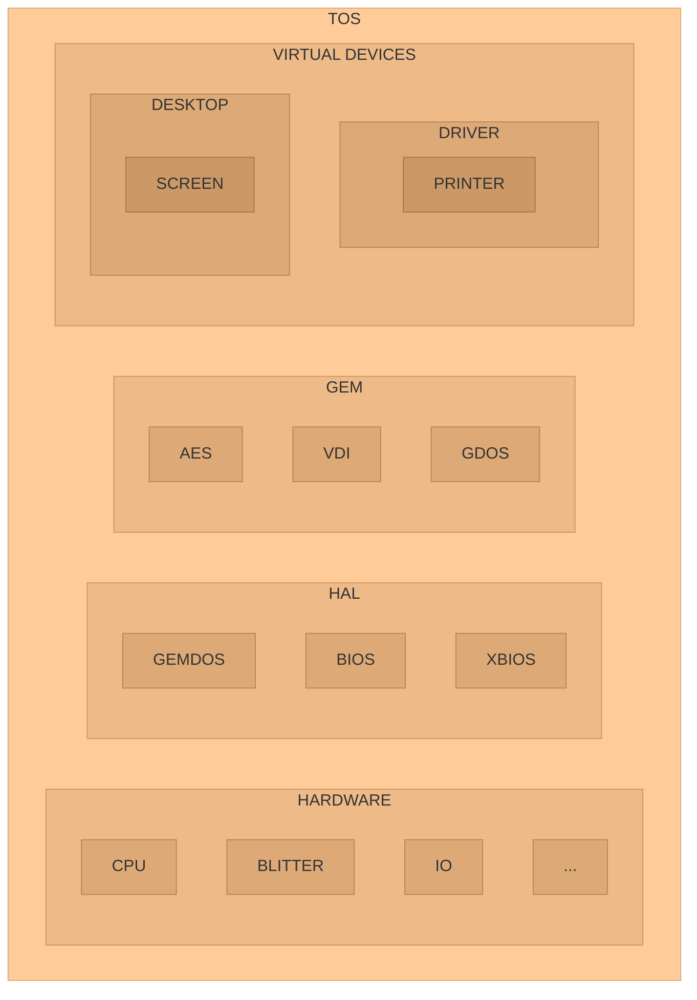

# atari-tos

Atari ST TOS documents, source codes and development tools.

From various sources, including cross-compiler to create programs and ROM image.

* Home

https://github.com/Kochise/atari-tos

* Also

[atari-docs] contains hardware documentations.

[atari-docs]: https://github.com/Kochise/atari-docs

[atari-emu] provides different emulators and bios images.

[atari-emu]: https://github.com/Kochise/atari-emu

## Architecture

Here is the general architecture of the TOS:

* TOS: The Operating System
	* GEM: Graphic Environment Manager
		* AES: Application Environment Services
		* VDI: Virtual Device Interface
		* GDOS: Graphics Device Operating System
	* HAL: Hardware Abstraction Layer
		* GEMDOS: GEM Disk Operating System
		* BIOS: Basic Input Output System
		* XBIOS: eXtended Basic Input Output System
	* HARDWARE
		* CPU: Central Processing Unit
		* BLITTER: Bit
		* IO: Input Output

Each part is subdivided into functions, parameters and files.

