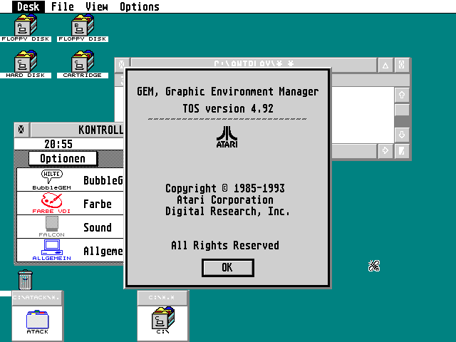
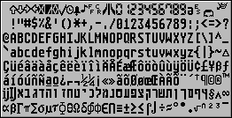
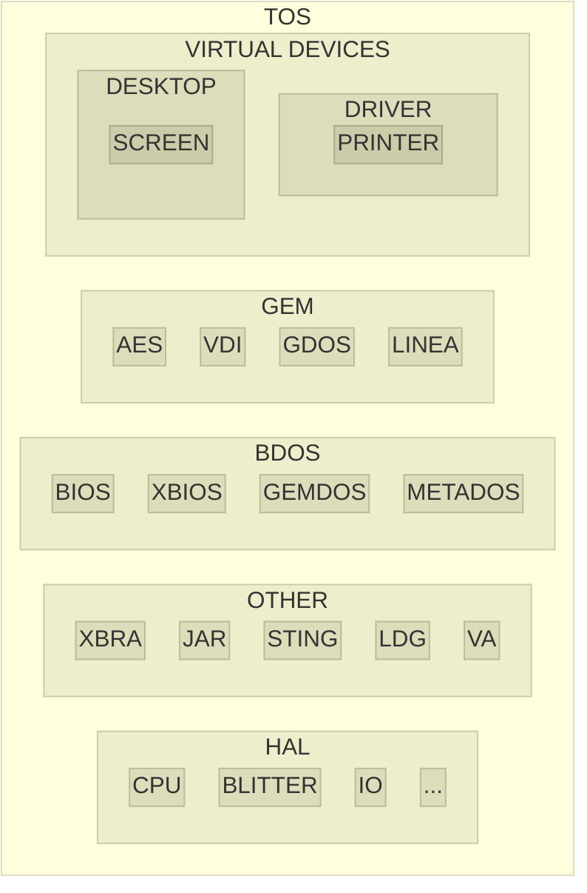

# atari-tos

<!--  -->

Atari ST TOS documents, source codes and development tools.

From various locations, including cross-compilers to create programs and ROM image.

* Home

https://github.com/Kochise/atari-tos

* Also

[atari-docs] contains hardware documentations.

[atari-docs]: https://github.com/Kochise/atari-docs

[atari-emu] provides different emulators and TOS images.

[atari-emu]: https://github.com/Kochise/atari-emu

Sources (click to expand)

https://github.com/ocgis/otosis

https://github.com/ocgis/oaesis

https://github.com/ocgis/ovdisis

https://github.com/th-otto/tos1x

https://github.com/th-otto/tos3x

https://github.com/ocgis/libotosis

https://github.com/kelihlodversson/pTOS

https://github.com/ggnkua/Atari_ST_Sources

Documentations (click to expand)

https://docs.dev-docs.org

http://info-coach.fr/atari

https://www.yardley.cc/atari

https://bus-error.nokturnal.pl/atari_compendium/html/toc.htm

https://www.fplanque.com/tech/retro/atari/atari-st-fd-image-file-formats

https://github.com/freemint/tos.hyp/tree/gh-pages -> https://freemint.github.io/tos.hyp

## History

The TOS is the operating system of the ATARI ST computers sold from 1985 to around 1992. It's development started in 1984 and ended in 1993 (then MultiTOS) when ATARI exited the computer market.

> [!NOTE]
> [Jack TRAMIEL], founder of COMMODORE, got fired from its company (like Steve JOBS later) and bought ATARI's computer division from WARNER, after the video game crash of 1983, with only goal to try killing COMMODORE and its upcoming Amiga. The technological choices of the time were absurdly based: cheap from off-the-self components, yet innovative with a graphical interface (as an insider, he of course knew what was coming ahead). His new motto was "power without the price", while at COMMODORE it was "computer for the masses, not the classes" (C64). Rinse and repeat.

[Jack TRAMIEL]: https://en.wikipedia.org/wiki/Jack_Tramiel

> [!NOTE]
> TOS means "The Operating System", while you may find some external references as it being called "Tramiel Operating System". Much like the ATARI ST was considered a cheap Macintosh rip-off and nicknamed "Jackintosh", Jack's Macintosh. Yet with the proper extension ([Spectre]) it could indeed emulate a Macintosh for a fraction of the price, and faster. For a time though, the ATARI ST line of computer evolving at a much slower pace than Apple's (16 MHz and 4 MB of memory in Mega STe).

[Spectre]: https://lowendmac.com/2016/atari-st-magic-sac-spectre-128-and-spectre-gcr/

It is most notably a port from DRI's GEMDOS, a successor to CP/M, and the GEM, a then "innovative" graphical interface, to 68k architecture. ATARI provided the hardware support and abstraction layer.

While the TOS got a graphical interface, it lacked a command line and scripting capabilities. Booting up an ATARI ST wasn't even providing an integrated programming language (ie. BASIC) like the less "gifted" 8 bits computers did until then. From a bare ST machine, you could just move icons around and that was it.

The GEM is inspired from the Xerox Alto, that also "inspired" APPLE for the Lisa and then the Macintosh. APPLE sued DRI's PC port of GEM for being too close of their own "inspiration", however the ATARI version was considered a too different product, mostly due to ATARI's own development[^1], and not a big threat (no business credibility and no school contract).

[^1]: https://en.wikipedia.org/wiki/GEM_(desktop_environment)#Atari_versions

The GEMDOS in the lower level part of the operating system, dealing with IO and disks. Unlike CP/M, it features a hierarchical file system (folders) but most of its file extensions are present in the TOS (ie. executable file's extension is also PRG).

> [!NOTE]
> Since young Microsoft wanted to hijack CP/M's market dominance, early version of MS DOS got a huge "inspiration" of it, up to almost copy its whole API, functions number are basically the same but not the names to avoid infringement. Hence the floppy disc layout is almost identical too, which made ATARI ST's compatible with MS DOS' as a side effect. But not hard drives, partition identifiers being different, and the GEMDOS not being 32 bits, no FAT32 or large partitions available later without some kind of hacking.

> [!NOTE]
> Also while most of the ASCII table is identical (0-127) with MS DOS and allows a pretty good compatibility, the upper part (128-255) is quite different (accented and graphic characters) which breaks European language support and TUI (Text User Interface). And of course the TOS is neither UTF nor Unicode capable, having only one "code page" available.

<!--  -->

Due to TOS being in ROM, it was harder to upgrade than a disk based version. Several RAM resident patches needed to be loaded during the boot, either from floppy disk or the hard drive. And the loading order was also important for most of them due to cross dependencies, something hardly documented and figured out from trial and error or system crashes.

Also keep in mind this is an OS created for a consumer product in the middle of the 80s. The ATARI ST computers of the time were barely able to run the full scale of what the GEM could offer, mostly due to memory constraints, hence the choice to skip the 128 KB and 256 KB versions but sell 512 KB and 1 MB configurations instead. The ROM size constraint also required the GDOS part to be offloaded to floppy disc as it couldn't be integrated into the TOS.

It's only around the beginning of the 90s, when even more memory (2, 4 or 14 MB for the Falcon030) and faster CPU (68030 with MMU, TT and Falcon030) became available, and affordable, that multitasking capable versions of TOS were released :

* [MiNT]: Mint is Not TOS, a shareware by Eric R. Smith, his kernel being mostly Posix compliant
* MultiTOS: Mint is Now TOS, MiNT licensed by Atari, then they hired Eric R. Smith until the end
* [FreeMiNT]: newer version of Mint, based on MiNT

[MiNT]: https://github.com/totalspectrum/atari-mint
[FreeMiNT]: https://freemint.github.io
[MagiC]: https://www.application-systems.de/magic/

Also the AES and desktop had to be upgraded to benefit from the multitasking kernel and allow more than one application to be present on screen (ie. switching between them, before Alt+tab was a thing) :

* Geneva: https://gribnif.github.io/downloads/geneva/
* XaAES: https://github.com/freemint/freemint/tree/master/xaaes - http://xaaes.gokmase.com/
* N.AES: https://woller.com/n.aes.html - https://atari.joska.no/n.aes/

On the desktop side :

* Ease: https://www.atari-forum.com/viewtopic.php?t=32323
* Gemini: https://github.com/gereons/gemini
* Gemini 2: https://github.com/gereons/gemini2
* Jinnee: https://www.application-systems.de/jinnee/
* Neodesk: https://gribnif.github.io/downloads/neodesk/
* Teradesk: https://github.com/freemint/teradesk
* Thing: https://arnowelzel.de/en/projects/thing

Also the VDI part could be upgraded with faster, hand-optimized, more feature-full versions :

* Quick ST: https://www.atariuptodate.de/en/3907/quick-st
* NVDI: https://www.application-systems.de/nvdi
* fVDI: https://github.com/freemint/fvdi

Other extensions also offered printer drivers (GDOS) or CD-ROM support (METADOS).

With the demise of ATARI newer features (drag'n drop), protocols (TCP), APIs (OpenGL) and technologies (USB, PCI) were provided by the community. As soon as one proposed implementation covered the need and was documented enough, it became the "de-facto standard". Until the original author stopped support.

Most of those additional libraries are now open sourced though, yet barely improved from their original version.

The newest incarnation of TOS, called EmuTOS, is based on the open sourced version of DRI's [PC GEM] (Caldera's [FreeGEM]) and a clean room reimplementation of the GEMDOS. This allowed to port it on Amiga hardware. Most bugs that required patches are fixed.

[PC GEM]: http://www.deltasoft.com
[FreeGEM]: https://en.wikipedia.org/wiki/FreeGEM

Yet the ecosystem remains a house of cards trying to glue together decades of legacy software into something somewhat coherent. Which surprisingly kinda works, thank to DRI's architectural foresight.

## Usage

Setting up a fully usable "modern" TOS system requires combining several parts together (kernel, AES, VDI, drivers, ...) and tweaking a lot of cryptic configuration files like on a 90s DOS PC. The experience requires dedication, the documentation being scarce and not very clear.

Some "distributions" tried to alleviate the hassle of setting such environments, like [OpenGEM] and [Owen's FreeGEM] (on PC), [VanillaMiNT] and [SpareMiNT] (on ATARI, based on [FreeMiNT]), etc.

[OpenGEM]: https://web.archive.org/web/20240404212333/http://www.opendawn.com/opengem
[Owen's FreeGEM]: https://owenrudge.net/GEM/dist
[VanillaMINT]: https://atari.joska.no/VanillaMiNT
[SpareMiNT]: https://freemint.github.io/sparemint
[SpareMiNT]: https://grokipedia.com/page/sparemint

Emulators of ATARI ST, TT and Falcon030 are now capable, yet trying to only emulate legacy speed, hence they are mostly used to run ST games, not use the TOS as a daily driver due to the lack of faster experience and proper up-to-date ecosystem.

There is no system-wide TOS support for now industry standard protocols (IMAP) and formats (MP4), each of them are being slowly ported to the TOS on a application basis. You need to know what each application is capable of and chain their usage in the right order. Hence you need to open several applications to perform operations between them until getting the job done.

If the TOS is not multitasking, that implies starting an application, loading a file, performing an operation on it, saving it, closing the application. Then launching another application for the next step, loading the file from the previous application, doing your thing and saving it in a format compatible with the next application. Rinse and repeat.

If the TOS is multitasking, and *if* the applications support copy/paste or drag/drop, they are mostly capable to work together and you may be able to "pipe" the data stream from one to the other to get the job done in a more seamless fashion. Sort of. Yet not the best user friendly experience since the "integration" remains weak.

Most of the applications have no printer capability, and if they have, they depend on the few 90s printers supported by GDOS/SpeedoGDOS/NVDI. While PDF output on TOS is like a Voodoo incantation, PS/EPS output format is possible though.

Don't expect to have modern software ported to TOS: no Firefox, no Blender, no Libre Office, etc. However recent versions of GCC haven been ported which allows compilation of programs with modern C version. Still, don't push your luck with C++.

## Architecture

Here is the general architecture of the TOS:

* TOS: The Operating System
	* GEM: Graphic Environment Manager
		* AES: Application Environment Services
		* VDI: Virtual Device Interface
		* GDOS: Graphics Device Operating System
	* BDOS: Basic Disk Operating System
		* BIOS: Basic Input Output System
		* XBIOS: eXtended Basic Input Output System
		* GEMDOS: GEM Disk Operating System
	* HAL: Hardware Abstraction Layer
		* CPU: Central Processing Unit
		* BLITTER: Bit
		* IO: Input Output

Each part is subdivided into functions, parameters and files.

## Programming

The ATARI ST is based on the [68000] processor which is 32 bits internal but "only" 16 bits on the data bus. Hence performing 32 bits operations, while being transparent from a developer's point of view, requires twice as much time to load and store the result into memory. Its internal ALU is 16 bits too and a 32 bits operation also requires twice the time of a 16 bits operation.

[68000]: https://en.wikipedia.org/wiki/Motorola_68000#Moving_to_16-bit

Thus typical data size is considered 16 bits in TOS. Here is the table of data size name depending on the language used:

| Size			| Assembler		| C			| GEM		| GFA v3				| Omikron			|
| :---			| :---			| :---		| :---		| :---					| :---				|
| 1 bit			| 				| bool		| 			| ! (16 bits)			| %F				|
| 8 bits		| .b			| char		| BYTE		| \| - BYTE()			| %B				|
| 16 bits		| .w			| short		| WORD		| & - CARD()			| %W or %			|
| 32 bits		| .l			| integer	| LONG		| % 					| %L or no suffix	|
| [float]		| .f (32 bits)	| float		| 			| 						| ! (6 bytes)		|
| [double]		| .d (64 bits)	| double	| 			| # or no suffix[^2]	| 					|
| [extended]	| .x (80 bits)	| 			| 			| 						| # (10 bytes)		|
| string		| 				| 			| 			| $ (32767 bytes max)	| $					|

[^2]: depends on DEFBIT(!), DEFBYT(|), DEFWRD(&), DEFINT(%), DEFFLT(#) or DEFSTR($)

[float]: https://en.wikipedia.org/wiki/Single-precision_floating-point_format
[double]: https://en.wikipedia.org/wiki/Double-precision_floating-point_format
[extended]: https://en.wikipedia.org/wiki/Extended_precision
