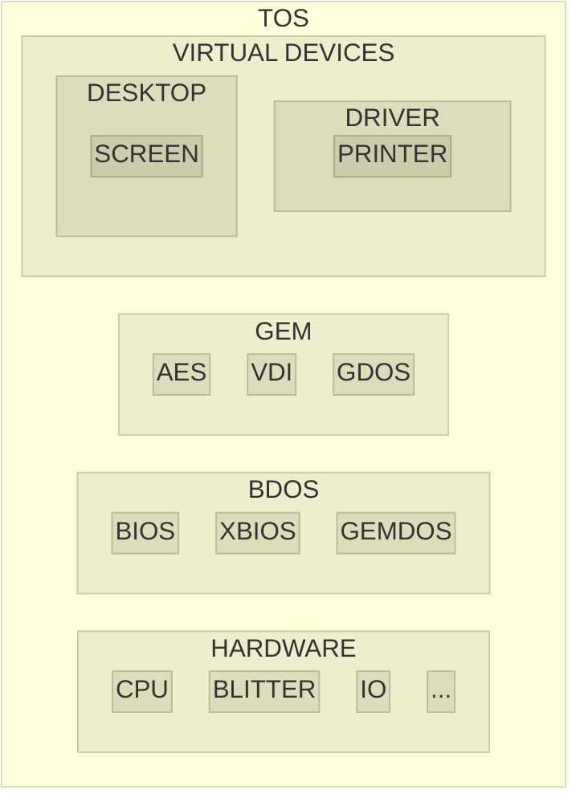

# atari-tos

Atari ST TOS documents, source codes and development tools.

From various locations, including cross-compilers to create programs and ROM image.

https://docs.dev-docs.org

http://info-coach.fr/atari

https://www.yardley.cc/atari

https://bus-error.nokturnal.pl/atari_compendium/html/toc.htm

https://www.fplanque.com/tech/retro/atari/atari-st-fd-image-file-formats

https://github.com/freemint/tos.hyp/tree/gh-pages -> https://freemint.github.io/tos.hyp

* Sources

https://github.com/th-otto/tos1x

https://github.com/th-otto/tos3x

https://github.com/kelihlodversson/pTOS

https://github.com/ggnkua/Atari_ST_Sources

* Home

https://github.com/Kochise/atari-tos

* Also

[atari-docs] contains hardware documentations.

[atari-docs]: https://github.com/Kochise/atari-docs

[atari-emu] provides different emulators and bios images.

[atari-emu]: https://github.com/Kochise/atari-emu

## Architecture

Here is the general architecture of the TOS:

* TOS: The Operating System
	* GEM: Graphic Environment Manager
		* AES: Application Environment Services
		* VDI: Virtual Device Interface
		* GDOS: Graphics Device Operating System
	* BDOS: Basic Disk Operating System
		* BIOS: Basic Input Output System
		* XBIOS: eXtended Basic Input Output System
		* GEMDOS: GEM Disk Operating System
	* HARDWARE
		* CPU: Central Processing Unit
		* BLITTER: Bit
		* IO: Input Output

Each part is subdivided into functions, parameters and files.

