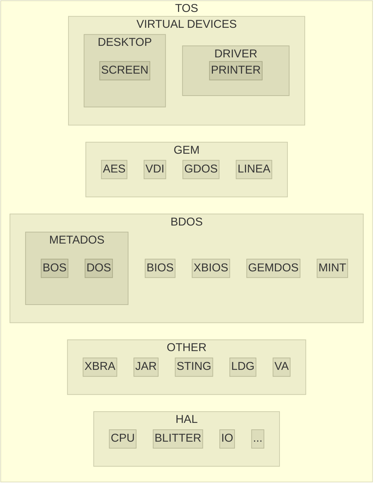

# atari-tos

<!--  -->

[Atari] [TOS] documents, source codes and development tools.

[Atari]: https://en.wikipedia.org/wiki/Atari_Corporation
[TOS]: https://en.wikipedia.org/wiki/Atari_TOS

From various locations, including cross-compilers to create programs and `ROM` image.

* Home

https://github.com/Kochise/atari-tos

* Also

[atari-docs] contains hardware documentations.

[atari-docs]: https://github.com/Kochise/atari-docs

[atari-emu] provides different emulators and **TOS** images.

[atari-emu]: https://github.com/Kochise/atari-emu

Sources (click to expand)

https://github.com/ocgis/otosis

https://github.com/ocgis/oaesis

https://github.com/ocgis/ovdisis

https://github.com/th-otto/tos1x

https://github.com/th-otto/tos3x

https://github.com/ocgis/libotosis

https://github.com/kelihlodversson/pTOS

https://github.com/ggnkua/Atari_ST_Sources

Documentations (click to expand)

https://docs.dev-docs.org

http://info-coach.fr/atari

https://www.yardley.cc/atari

https://bus-error.nokturnal.pl/atari_compendium/html/toc.htm

https://www.fplanque.com/tech/retro/atari/atari-st-fd-image-file-formats

https://github.com/freemint/tos.hyp/tree/gh-pages -> https://freemint.github.io/tos.hyp

## History

The **TOS** is the operating system of the **Atari** computers sold from 1985 to around 1992. It's development started in 1984 and ended in 1993 (then [MultiTOS]) when **Atari** exited the computer market.

[MultiTOS]: https://en.wikipedia.org/wiki/MiNT

> [!IMPORTANT]
> Keep in mind that everything that you'll read below happened when graphic interfaces were like science-fiction. Like, really. **Windows 1.0** was released on November 20, 1985 while the **Atari** [ST] was released on April 8, 1985, more than 7 months *prior*. And the **TOS** had already features **Windows** would only reach by version 2 or 3. In 1992 **TOS 4.0** got its "3D look" (see screenshot above) which was 3 years *prior* to the release of **Windows 95**. Just to reframe things a bit into perspective...

[ST]: https://en.wikipedia.org/wiki/Atari_ST

> [!NOTE]
> [Jack TRAMIEL], founder of **Commodore**, got fired from his own company by *Irving GOULD* (like *Steve JOBS* later by *John SCULLEY*) and bought **Atari**'s computer division from **Warner**, after the video game crash of 1983, with only goal to try killing **Commodore** and its upcoming [Amiga]. The technological choices of the time were absurdly based: cheap off-the-self components, yet innovative with a graphical interface (as an ex-**Commodore** insider, he of course knew what was coming ahead). His new motto was "power without the price", while at **Commodore** it was "computer for the masses, not the classes" (**C64**). *Rinse and repeat*.

[Jack TRAMIEL]: https://en.wikipedia.org/wiki/Jack_Tramiel
[Amiga]: https://morphosuser.wordpress.com/2014/07/09/the-very-beginning-the-long-story-of-the-amiga/

> [!NOTE]
> **TOS** means "*The* Operating System", while you may find some external references as it being called "*Tramiel* Operating System". Much like the **Atari** **ST** was considered a cheap **Macintosh** rip-off and nicknamed "Jackintosh", Jack's **Macintosh**. Btw, with the proper extension ([Spectre]) it could indeed emulate a **Macintosh** for a fraction of the price, and slightly faster with that. For a time though, as the **Atari** line of computer was evolving at a much slower pace than **Apple**'s (16 MHz and 4 MB of memory tops in [Mega STe], [TT] and [Falcon030] were too late with too little support).

[Spectre]: https://lowendmac.com/2016/atari-st-magic-sac-spectre-128-and-spectre-gcr/
[Mega STe]: https://en.wikipedia.org/wiki/Atari_MEGA_STE
[TT]: https://en.wikipedia.org/wiki/Atari_TT030
[Falcon030]: https://en.wikipedia.org/wiki/Atari_Falcon

The **TOS** is most notably a port from [Digital Research Inc] (aka **DRI**) **GEMDOS**, a successor to their own [CP/M], and the [GEM], a then "innovative" graphical interface, to 68k architecture. **Atari** provided the hardware support and abstraction layer.

[Digital Research Inc]: https://en.wikipedia.org/wiki/Digital_Research
[CP/M]: https://en.wikipedia.org/wiki/CP/M
[GEM]: https://en.wikipedia.org/wiki/GEM_(desktop_environment)

You may have a little insight of the development chaos during that era in those old blog entries:

https://web.archive.org/web/20191220215137/http://www.dadhacker.com/blog/?p=995

https://web.archive.org/web/20191206165904/http://www.dadhacker.com/blog/?p=1000

https://web.archive.org/web/20190531084112/http://www.fultonsoft.com/category/atari-st/

While the **TOS** got a graphical interface, it lacked a command line and scripting capabilities. Booting up an **Atari** **ST** wasn't even providing an integrated programming language (i.e. **BASIC**) like the less "gifted" 8 bits computers did until then. From a bare **ST** machine, you could just move icons around if you had no floppy disc with the required program and that was it.

The **GEM** is inspired from the [Xerox] [Alto] of 1973 (10 years *prior*), that also "inspired" **Apple** for the **Lisa** and then the **Macintosh**. **Apple** sued **DRI**'s **PC** port of **GEM** for being too close of their own "inspiration", however the **Atari** version was considered a too different product, mostly due to **Atari**'s own involvement in the development[^1], and not a big threat (no business credibility and no school contract).

[Xerox]: https://en.wikipedia.org/wiki/PARC_(company)
[Alto]: https://en.wikipedia.org/wiki/Xerox_Alto

[^1]: https://en.wikipedia.org/wiki/GEM_(desktop_environment)#Atari_versions

The **GEMDOS** in the lower level part of the operating system, dealing with `IO` and disks. Unlike **CP/M**, it features a hierarchical file system (folders) yet most of its file extensions are still present in the **TOS** (i.e. executable file  extension is also `PRG`).

> [!NOTE]
> Since young **Microsoft** (aka **MS**) wanted to hijack **CP/M**'s market dominance, early version of **MS-DOS** got a [huge] "[inspiration]" [out] [of] it, up to almost copy its whole `API`, functions number are [basically the same] but not the names to avoid infringement. Hence the floppy disc layout is almost identical too, which made **Atari** **ST**'s compatible with **MS-DOS**' as a side effect. But not hard drives though, partition identifiers being different, and the **GEMDOS** not being 32 bits so no `FAT32` or large partitions available, at least not without some kind of "hacking".

[huge]: https://www.scirp.org/journal/paperinformation?paperid=46362
[inspiration]: https://www.scirp.org/journal/paperinformation?paperid=71259
[out]: https://www.embedded.com/was-dos-copied-from-cp-m/
[of]: http://kildall.org/cpmvsdos.html
[basically the same]: https://docs.google.com/spreadsheets/d/12XHJ6YHRDfvNhtnlzEINBjRRXZPKvDQgI7AI424oTws/edit?gid=0#gid=0

> [!NOTE]
> Also while most of the `ASCII` table is identical (0-127) with **MS-DOS** and allows a pretty good compatibility, the upper part (128-255) is quite different (accented and graphic characters) which breaks European language support and `TUI` (Text User Interface). And of course the **TOS** is neither `UTF` nor `Unicode` capable, having only one "code page" available.

<!--  -->

Due to **TOS** being in `ROM`, it was harder to upgrade than a disk based version. Several `TSR` (Terminate and Stay Resident) patches needed to be loaded during the boot and kept into `RAM`, thus impacting what was left available for the user. Either to fix existing routines or to provide newer functionalities. As a side effect the loading order was also important for most of them due to potential cross dependencies (i.e. GEMRAM first, then WINX), something hardly documented and figured out from trial and error, or system crashes. Not better than the **MS-DOS** experience of the time.

Also keep in mind this is an `OS` created for a consumer product in the middle of the 80s. The **Atari** **ST** computers of the time were barely able to run the full scale of what the **GEM** could offer, mostly due to memory constraints, hence the choice to skip the 128 KB and 256 KB versions (what the original [Macintosh 128K] offered for $2499) but sell 512 KB and 1 MB configurations instead (what **Atari** offered for $799 with monochrome monitor and $999 with a colour one). The `ROM` size constraint also required the **GDOS** part (scalable fonts and printing drivers) to be offloaded to floppy disc as it couldn't be integrated into the **TOS**.

[Macintosh 128K]: https://www.mac-history.net/the-macintosh-the-many-facets-of-a-slightly-flawed-gem/

It's only around the beginning of the 90s, when even more memory (2, 4 or 14 MB for the **Falcon030**, dedicated "TT-RAM" for the **TT**) and faster `CPU` ([68030] with `MMU`, like in **TT** and **Falcon030**) became available (and affordable) that multitasking capable versions of **TOS** were released:

[68030]: https://en.wikipedia.org/wiki/Motorola_68030

* [MiNT]: Mint is *Not* **TOS**, a shareware by *Eric R. Smith*, his kernel being mostly **Posix** compliant
* **MultiTOS**: Mint is *Now* **TOS**, [MiNT] licensed by **Atari**, then they hired *Eric R. Smith* until their demise
* [FreeMiNT]: newer version of **MultiTOS**, based on [MiNT]

[MiNT]: https://github.com/totalspectrum/atari-mint
[FreeMiNT]: https://freemint.github.io
[MagiC]: https://www.application-systems.de/magic/

Also the **AES** and desktop had to be upgraded to benefit from the multitasking kernel and allow more than one application to be present on screen (i.e. switching between them, before `Alt+Tab` was a thing):

* **Geneva**: https://gribnif.github.io/downloads/geneva
* **XaAES**: https://github.com/freemint/freemint/tree/master/xaaes - http://xaaes.gokmase.com
* **N.AES**: https://woller.com/n.aes.html - https://atari.joska.no/n.aes

On the desktop side :

* **Ease**: https://www.atari-forum.com/viewtopic.php?t=32323
* **Gemini**: https://github.com/gereons/gemini
* **Gemini 2**: https://github.com/gereons/gemini2
* **Jinnee**: https://www.application-systems.de/jinnee
* **Neodesk**: https://gribnif.github.io/downloads/neodesk
* **Teradesk**: https://github.com/freemint/teradesk
* **Thing**: https://arnowelzel.de/en/projects/thing

Also the **VDI** part could be upgraded with faster, hand-optimized, more feature-full versions:

* **Quick ST**: https://www.atariuptodate.de/en/3907/quick-st
* **NVDI**: https://www.application-systems.de/nvdi
* **fVDI**: https://github.com/freemint/fvdi

Other extensions also offered printer drivers (**GDOS** mentioned above), better hard disk drivers (**AHDI**) or `CD-ROM` support (**METADOS**).

With the demise of **Atari**, newer features (drag'n drop), protocols (`TCP`), `API`s (`OpenGL`) and technologies (`USB`, `PCI`) were provided by the community. As soon as one proposed implementation covered the need and was documented enough, it became the "de-facto standard". Until the original author stopped support.

Most of those additional libraries are now open sourced though, yet barely improved from their original version.

The newest incarnation of **TOS**, called [EmuTOS], is based on the open sourced version of **DRI**'s [PC-GEM] (**Caldera**'s [FreeGEM]) and a clean room reimplementation of the **GEMDOS**. This allowed to port it on **Amiga** hardware. Most bugs that required patches were fixed.

[EmuTOS]: https://emutos.sourceforge.io
[PC-GEM]: http://www.deltasoft.com
[FreeGEM]: https://en.wikipedia.org/wiki/FreeGEM

Yet the ecosystem remains a house of cards trying to glue together decades of legacy software into something somewhat coherent. Which surprisingly kinda works, thank to **DRI**'s architectural foresight.

## Usage

Setting up a fully usable "modern" **TOS** system requires combining several parts together (kernel, **AES**, **VDI**, drivers, ...) and tweaking a lot of cryptic configuration files like on a 90s **DOS**-based **PC**. The experience requires dedication, the documentation being scarce and not very clear.

Some "distributions" tried to alleviate the hassle of setting such environments, like [OpenGEM] and [Owen's FreeGEM] (on **PC**), [VanillaMiNT] and [SpareMiNT] (on **Atari**, based on [FreeMiNT]), etc.

[OpenGEM]: https://web.archive.org/web/20240404212333/http://www.opendawn.com/opengem
[Owen's FreeGEM]: https://owenrudge.net/GEM/dist

[VanillaMINT]: https://atari.joska.no/VanillaMiNT
[SpareMiNT]: https://freemint.github.io/sparemint
[SpareMiNT]: https://grokipedia.com/page/sparemint

Emulators of **Atari** **ST**, **TT** and **Falcon030** are now capable, yet trying to only emulate legacy speed, hence they are mostly used to run **ST** games, not use the **TOS** as a daily driver due to the lack of faster experience and proper up-to-date ecosystem.

There is no system-wide **TOS** support for now industry standard protocols (`IMAP`, etc) and formats (`MP4`, etc), each of them are being slowly ported to the **TOS** on a application basis. You need to know what each application is capable of and chain their usage in the right order. Hence you need to open several applications to perform operations between them until getting the job done.

If the **TOS** is not multitasking, that implies starting an application, loading a file, performing an operation on it, saving it, closing the application. Then launching another application for the next step, loading the file from the previous application, doing your thing and saving it in a format compatible with the next application. *Rinse and repeat*.

If the **TOS** is multitasking, and *if* the applications support copy/paste or drag/drop, they are mostly capable to work together and you may be able to "pipe" the data stream from one to the other to get the job done in a more seamless fashion. Sort of. Yet not the best user friendly experience since the "integration" remains weak.

Most of the applications have no printer capability, and if they have, they depend on the few 90s printers supported by **GDOS**/**SpeedoGDOS**/**NVDI** (links above). While `PDF` output on **TOS** is like a Voodoo incantation, `PS`/`EPS` output format is more probable though.

Don't expect to have modern software ported to **TOS**: no **Firefox**, no **Blender**, no **Libre Office**, etc. The technical constraints (memory, `CPU` speed, hard drive capacity, etc) just don't allow it. However recent versions of `C` compilers for `m68k` platform have been ported to **TOS** (see [Programming](https://github.com/Kochise/atari-tos#programming) section below) which allow native compilation of program with "modern" support.

Still, don't push your luck with `C++`, if only to get bloated binaries and crawling execution speed. We're still talking 90s era computers and operating system.

Even more recent **Atari** clones like the [Firebee] or **Vampire** [V4SA] can't really keep up with "modern" needs (still no **Firefox**, no **Blender**, no **Libre Office**, etc). Just running "legacy" **TOS** applications, if compatibility layers permit it, yet notably faster. But nothing ground breaking, it's ways from being **Ryzen**-tier hardware.

[Firebee]: https://firebee.org/fb-bin/index?&lng=EN
[V4SA]: https://www.apollo-computer.com/atari.php

## Architecture

Here is the general architecture of the **TOS**:

* TOS: The Operating System
	* VD: Virtual Device
		* DESKTOP: AES windowing environment
		* DRIVER: interface to devices
	* GEM: Graphic Environment Manager
		* AES: Application Environment Services
		* VDI: Virtual Device Interface
		* GDOS: Graphical Device Operating System
	* BDOS: Basic Disk Operating System
		* BIOS: Basic Input Output System
		* XBIOS: eXtended Basic Input Output System
		* GEMDOS: GEM Disk Operating System
		* METADOS: loadable filesystem manager
			* BOS: Basic Operating System
			* DOS: Disk Operating System
		* MINT: loadable multitasking kernel
	* HAL: Hardware Abstraction Layer
		* CPU: Central Processing Unit
		* BLITTER: Bit
		* IO: Input Output

Each part is subdivided into functions, parameters, extensions and files.

> [!NOTE]
> Some extensions can replace system routines by redirecting calling vectors. That's often when problems arise because of loading order, which one is taking over precedence. No operating system is exempt from this though.

> [!TIP]
> You can click the links in the diagram below to get to the dedicated page. With `Ctrl+click` it opens another tab with the requested page.

## Programming

The **Atari** **ST** is based on the **Motorola** [68000] processor (1979) which is 32 bits internal, but "only" 16 bits on the data bus. Hence performing 32 bits operations, while being transparent from a developer's point of view, requires twice as much time to load and store the result into memory, than just a 16 bits operation. Makes sense though. Its internal `ALU` is 16 bits too and as such a 32 bits operation also requires twice the time of a 16 bits operation. *Rinse and repeat*.

[68000]: https://en.wikipedia.org/wiki/Motorola_68000#Moving_to_16-bit

Thus typical data size is considered 16 bits in **TOS**. Here is the table of data size name depending on the language used:

| Size			| Assembler		| C			| GEM		| GFA v3				| Omikron			|
| :---			| :---			| :---		| :---		| :---					| :---				|
| 1 bit			| 				| bool		| 			| ! (16 bits)			| %F				|
| 8 bits		| .b			| char		| BYTE		| \| - BYTE()			| %B				|
| 16 bits		| .w			| short		| WORD		| & - CARD()			| %W or %			|
| 32 bits		| .l			| integer	| LONG		| % 					| %L or no suffix	|
| [float]		| .f (32 bits)	| float		| 			| 						| ! (6 bytes)		|
| [double]		| .d (64 bits)	| double	| 			| # or no suffix[^2]	| 					|
| [extended]	| .x (80 bits)	| 			| 			| 						| # (10 bytes)		|
| string		| 				| 			| 			| $ (32767 bytes max)	| $					|

[^2]: depends on DEFBIT(!), DEFBYT(|), DEFWRD(&), DEFINT(%), DEFFLT(#) or DEFSTR($)

[float]: https://en.wikipedia.org/wiki/Single-precision_floating-point_format
[double]: https://en.wikipedia.org/wiki/Double-precision_floating-point_format
[extended]: https://en.wikipedia.org/wiki/Extended_precision

> [!IMPORTANT]
> The **Atari** **TOS** is profoundly 16 bits at its core, the base size is a `WORD`/`short` and memory alignments are set accordingly.

To sum it up: if you don't need 32 bits operations, just don't use them.

Here are a few development kits (old and new):

https://github.com/SegHaxx/atari-st-devkit very outdated, more for archival purpose, yet it did the job back then.

https://tho-otto.de/crossmint.php up to date **GCC** (2025), at least speaking of `m68k`, with all the quirks it implies.

http://www.compilers.de/vbcc.html quite recent (2022) `C99` compiler with many `m68k` hosts and targets.

https://retrogamecoders.com/atari-st-programming-cross-development-with-modern-ides/ "modern" cross-`IDE`.

https://github.com/dgis/vscode-atari-st-dev someone had to do it, so someone did it. Send prayers and thoughts.

