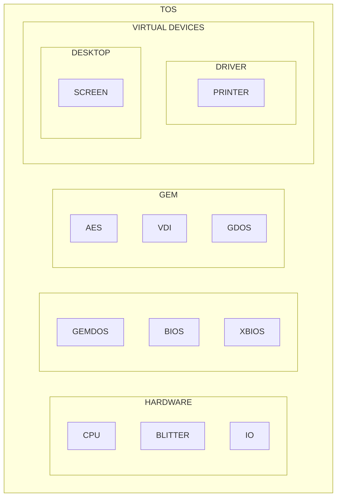

# atari-tos

Atari ST TOS documents, source codes and development tools.

From various sources, including cross-compiler to create ROM image.

* Home

https://github.com/Kochise/atari-tos

Also [atari-docs] contains hardware documentations.

[atari-docs]: https://github.com/Kochise/atari-docs

## Architecture

